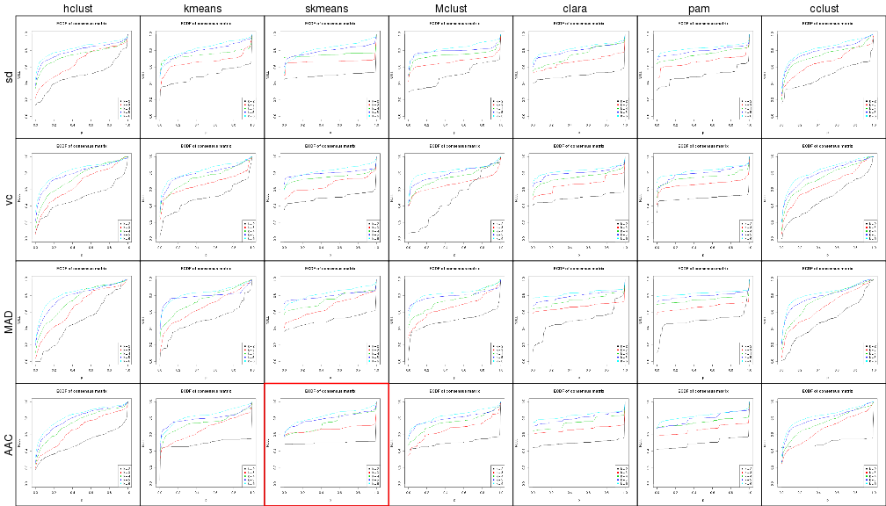
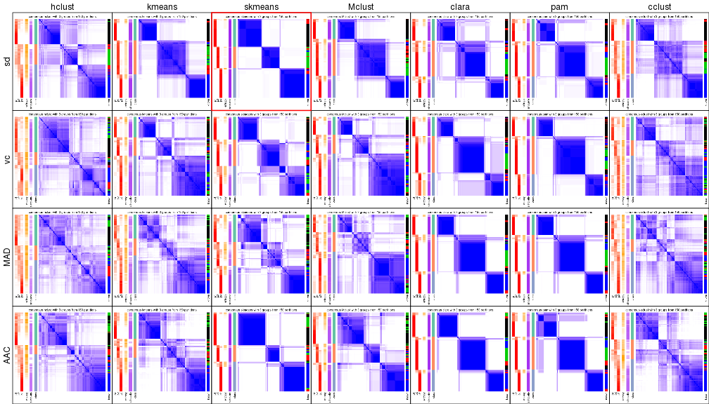
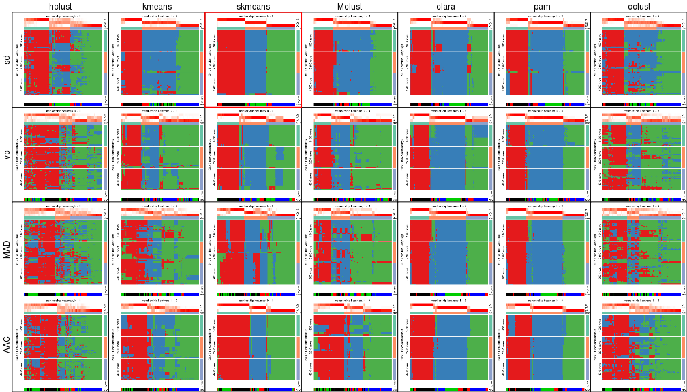
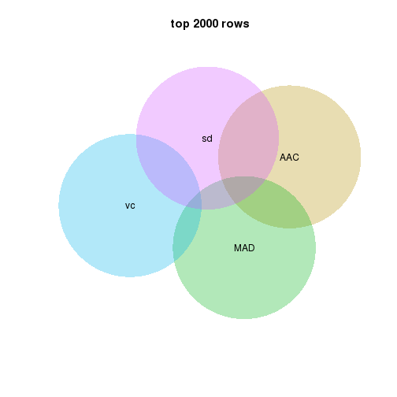
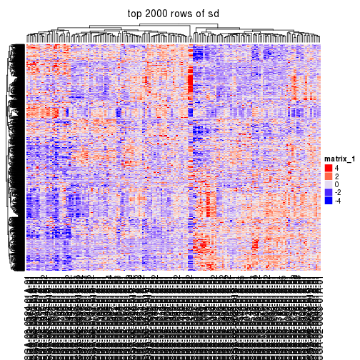
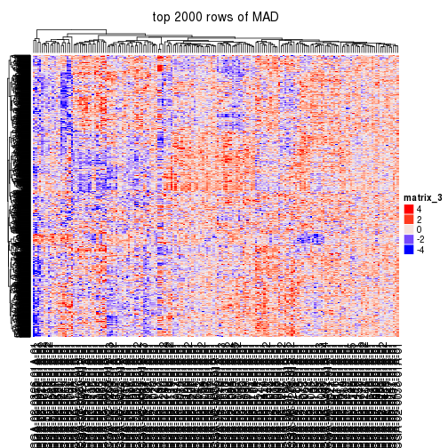
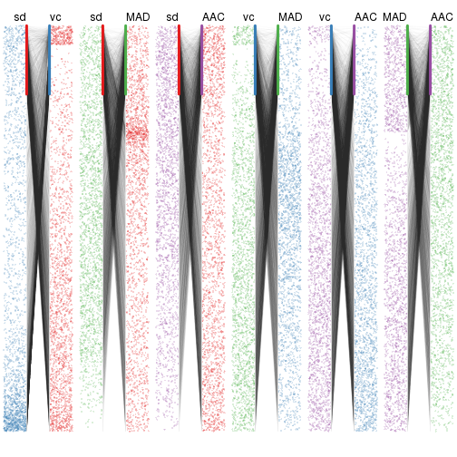
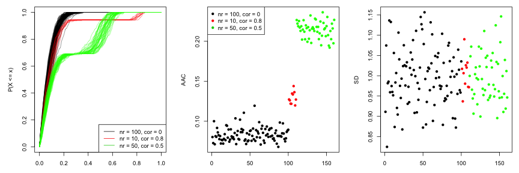
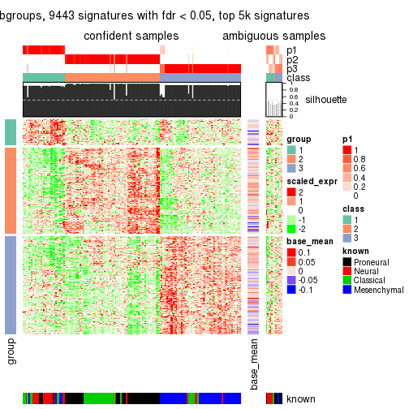

```r
suppressPackageStartupMessages(source("/home/guz/project/development/cola/load.R"))
```


```r
data = read.table("/icgc/dkfzlsdf/analysis/B080/guz/subgroup_test/unifiedScaled.txt", 
	header = TRUE, row.names = 1, check.names = FALSE)
data = as.matrix(data)

subtype = read.table("/icgc/dkfzlsdf/analysis/B080/guz/subgroup_test/TCGA_unified_CORE_ClaNC840.txt", 
	sep = "\t", header = TRUE, check.names = FALSE, stringsAsFactors = FALSE)
subtype = structure(unlist(subtype[1, -(1:2)]), names = colnames(subtype)[-(1:2)])

data = data[, names(subtype)]
dim(data)
```

```
## [1] 11861   173
```

```r
subtype
```

```
## TCGA-02-0003-01A-01 TCGA-02-0010-01A-01 TCGA-02-0011-01B-01 
##         "Proneural"         "Proneural"         "Proneural" 
## TCGA-02-0014-01A-01 TCGA-02-0024-01B-01 TCGA-02-0026-01B-01 
##         "Proneural"         "Proneural"         "Proneural" 
## TCGA-02-0028-01A-01 TCGA-02-0046-01A-01 TCGA-02-0047-01A-01 
##         "Proneural"         "Proneural"         "Proneural" 
## TCGA-02-0048-01A-01 TCGA-02-0060-01A-01 TCGA-02-0069-01A-01 
##         "Proneural"         "Proneural"         "Proneural" 
## TCGA-02-0074-01A-01 TCGA-02-0080-01A-01 TCGA-02-0084-01A-03 
##         "Proneural"         "Proneural"         "Proneural" 
## TCGA-02-0087-01A-01 TCGA-02-0104-01A-01 TCGA-02-0114-01A-01 
##         "Proneural"         "Proneural"         "Proneural" 
## TCGA-02-0281-01A-01 TCGA-02-0321-01A-01 TCGA-02-0325-01A-01 
##         "Proneural"         "Proneural"         "Proneural" 
## TCGA-02-0338-01A-01 TCGA-02-0339-01A-01 TCGA-02-0432-01A-02 
##         "Proneural"         "Proneural"         "Proneural" 
## TCGA-02-0439-01A-01 TCGA-02-0440-01A-01 TCGA-02-0446-01A-01 
##         "Proneural"         "Proneural"         "Proneural" 
## TCGA-06-0128-01A-01 TCGA-06-0129-01A-01 TCGA-06-0146-01A-01 
##         "Proneural"         "Proneural"         "Proneural" 
## TCGA-06-0156-01A-01 TCGA-06-0166-01A-01 TCGA-06-0174-01A-01 
##         "Proneural"         "Proneural"         "Proneural" 
## TCGA-06-0177-01A-01 TCGA-06-0238-01A-02 TCGA-06-0241-01A-02 
##         "Proneural"         "Proneural"         "Proneural" 
## TCGA-06-0410-01A-01 TCGA-06-0413-01A-01 TCGA-06-0414-01A-01 
##         "Proneural"         "Proneural"         "Proneural" 
## TCGA-06-0646-01A-01 TCGA-06-0648-01A-01 TCGA-08-0245-01A-01 
##         "Proneural"         "Proneural"         "Proneural" 
## TCGA-08-0344-01A-01 TCGA-08-0347-01A-01 TCGA-08-0348-01A-01 
##         "Proneural"         "Proneural"         "Proneural" 
## TCGA-08-0350-01A-01 TCGA-08-0353-01A-01 TCGA-08-0359-01A-01 
##         "Proneural"         "Proneural"         "Proneural" 
## TCGA-08-0385-01A-01 TCGA-08-0517-01A-01 TCGA-08-0524-01A-01 
##         "Proneural"         "Proneural"         "Proneural" 
## TCGA-12-0616-01A-01 TCGA-12-0618-01A-01 TCGA-02-0089-01A-01 
##         "Proneural"         "Proneural"            "Neural" 
## TCGA-02-0113-01A-01 TCGA-02-0115-01A-01 TCGA-02-0451-01A-01 
##            "Neural"            "Neural"            "Neural" 
## TCGA-06-0132-01A-02 TCGA-06-0133-01A-02 TCGA-06-0138-01A-02 
##            "Neural"            "Neural"            "Neural" 
## TCGA-06-0160-01A-01 TCGA-06-0162-01A-01 TCGA-06-0167-01A-01 
##            "Neural"            "Neural"            "Neural" 
## TCGA-06-0171-01A-02 TCGA-06-0173-01A-01 TCGA-06-0179-01A-02 
##            "Neural"            "Neural"            "Neural" 
## TCGA-06-0182-01A-01 TCGA-06-0185-01A-01 TCGA-06-0195-01B-01 
##            "Neural"            "Neural"            "Neural" 
## TCGA-06-0208-01B-01 TCGA-06-0214-01A-02 TCGA-06-0219-01A-01 
##            "Neural"            "Neural"            "Neural" 
## TCGA-06-0221-01A-01 TCGA-06-0237-01A-02 TCGA-06-0240-01A-02 
##            "Neural"            "Neural"            "Neural" 
## TCGA-08-0349-01A-01 TCGA-08-0380-01A-01 TCGA-08-0386-01A-01 
##            "Neural"            "Neural"            "Neural" 
## TCGA-08-0520-01A-01 TCGA-02-0007-01A-01 TCGA-02-0009-01A-01 
##            "Neural"         "Classical"         "Classical" 
## TCGA-02-0016-01A-01 TCGA-02-0021-01A-01 TCGA-02-0023-01B-01 
##         "Classical"         "Classical"         "Classical" 
## TCGA-02-0027-01A-01 TCGA-02-0038-01A-01 TCGA-02-0043-01A-01 
##         "Classical"         "Classical"         "Classical" 
## TCGA-02-0070-01A-01 TCGA-02-0102-01A-01 TCGA-02-0260-01A-03 
##         "Classical"         "Classical"         "Classical" 
## TCGA-02-0269-01B-01 TCGA-02-0285-01A-01 TCGA-02-0289-01A-01 
##         "Classical"         "Classical"         "Classical" 
## TCGA-02-0290-01A-01 TCGA-02-0317-01A-01 TCGA-02-0333-01A-02 
##         "Classical"         "Classical"         "Classical" 
## TCGA-02-0422-01A-01 TCGA-02-0430-01A-01 TCGA-06-0125-01A-01 
##         "Classical"         "Classical"         "Classical" 
## TCGA-06-0126-01A-01 TCGA-06-0137-01A-03 TCGA-06-0145-01A-04 
##         "Classical"         "Classical"         "Classical" 
## TCGA-06-0148-01A-01 TCGA-06-0187-01A-01 TCGA-06-0211-01B-01 
##         "Classical"         "Classical"         "Classical" 
## TCGA-06-0402-01A-01 TCGA-08-0246-01A-01 TCGA-08-0354-01A-01 
##         "Classical"         "Classical"         "Classical" 
## TCGA-08-0355-01A-01 TCGA-08-0357-01A-01 TCGA-08-0358-01A-01 
##         "Classical"         "Classical"         "Classical" 
## TCGA-08-0375-01A-01 TCGA-08-0511-01A-01 TCGA-08-0514-01A-01 
##         "Classical"         "Classical"         "Classical" 
## TCGA-08-0518-01A-01 TCGA-08-0529-01A-02 TCGA-08-0531-01A-01 
##         "Classical"         "Classical"         "Classical" 
## TCGA-02-0057-01A-01 TCGA-02-0004-01A-01 TCGA-02-0006-01B-01 
##       "Mesenchymal"       "Mesenchymal"       "Mesenchymal" 
## TCGA-02-0025-01A-01 TCGA-02-0033-01A-01 TCGA-02-0034-01A-01 
##       "Mesenchymal"       "Mesenchymal"       "Mesenchymal" 
## TCGA-02-0039-01A-01 TCGA-02-0051-01A-01 TCGA-02-0054-01A-01 
##       "Mesenchymal"       "Mesenchymal"       "Mesenchymal" 
## TCGA-02-0055-01A-01 TCGA-02-0059-01A-01 TCGA-02-0064-01A-01 
##       "Mesenchymal"       "Mesenchymal"       "Mesenchymal" 
## TCGA-02-0075-01A-01 TCGA-02-0079-01A-03 TCGA-02-0085-01A-01 
##       "Mesenchymal"       "Mesenchymal"       "Mesenchymal" 
## TCGA-02-0086-01A-01 TCGA-02-0099-01A-01 TCGA-02-0106-01A-01 
##       "Mesenchymal"       "Mesenchymal"       "Mesenchymal" 
## TCGA-02-0107-01A-01 TCGA-02-0111-01A-01 TCGA-02-0326-01A-01 
##       "Mesenchymal"       "Mesenchymal"       "Mesenchymal" 
## TCGA-02-0337-01A-01 TCGA-06-0122-01A-01 TCGA-06-0124-01A-01 
##       "Mesenchymal"       "Mesenchymal"       "Mesenchymal" 
## TCGA-06-0130-01A-01 TCGA-06-0139-01A-01 TCGA-06-0143-01A-01 
##       "Mesenchymal"       "Mesenchymal"       "Mesenchymal" 
## TCGA-06-0147-01A-01 TCGA-06-0149-01A-05 TCGA-06-0152-01A-02 
##       "Mesenchymal"       "Mesenchymal"       "Mesenchymal" 
## TCGA-06-0154-01A-02 TCGA-06-0164-01A-01 TCGA-06-0175-01A-01 
##       "Mesenchymal"       "Mesenchymal"       "Mesenchymal" 
## TCGA-06-0176-01A-03 TCGA-06-0184-01A-01 TCGA-06-0189-01A-05 
##       "Mesenchymal"       "Mesenchymal"       "Mesenchymal" 
## TCGA-06-0190-01A-01 TCGA-06-0194-01A-01 TCGA-06-0197-01A-02 
##       "Mesenchymal"       "Mesenchymal"       "Mesenchymal" 
## TCGA-06-0210-01A-01 TCGA-06-0397-01A-01 TCGA-06-0409-01A-02 
##       "Mesenchymal"       "Mesenchymal"       "Mesenchymal" 
## TCGA-06-0412-01A-01 TCGA-06-0644-01A-02 TCGA-06-0645-01A-01 
##       "Mesenchymal"       "Mesenchymal"       "Mesenchymal" 
## TCGA-08-0346-01A-01 TCGA-08-0352-01A-01 TCGA-08-0360-01A-01 
##       "Mesenchymal"       "Mesenchymal"       "Mesenchymal" 
## TCGA-08-0390-01A-01 TCGA-08-0392-01A-01 TCGA-08-0509-01A-01 
##       "Mesenchymal"       "Mesenchymal"       "Mesenchymal" 
## TCGA-08-0510-01A-01 TCGA-08-0512-01A-01 TCGA-08-0522-01A-01 
##       "Mesenchymal"       "Mesenchymal"       "Mesenchymal" 
## TCGA-12-0619-01A-01 TCGA-12-0620-01A-01 
##       "Mesenchymal"       "Mesenchymal"
```


```r
ALL_TOP_VALUE_METHOD()
```

```
## [1] "sd"  "vc"  "MAD" "AAC"
```

```r
ALL_PARTITION_METHOD()
```

```
## [1] "hclust"  "kmeans"  "skmeans" "Mclust"  "clara"   "pam"     "cclust"
```


```r
res_list = run_all(data, top_n = c(2000, 4000, 6000), k = 2:6, known = subtype, mc.cores = 4)
```


```r
res_list = readRDS("/icgc/dkfzlsdf/analysis/B080/guz/subgroup_test/TCGA_subgroup_p0.8.rds")
res_list
```

```
## Top rows are extracted by 'sd, vc, MAD, AAC' methods.
## Subgroups are detected by 'hclust, kmeans, skmeans, Mclust, clara, pam, cclust' method.
## Number of partitions are tried for k = 2, 3, 4, 5, 6
```


```r
collect_plots(res_list, fun = plot_ecdf)
```



```r
collect_plots(res_list, k = 3, fun = consensus_heatmap)
```



```r
collect_plots(res_list, k = 3, fun = membership_heatmap)
```




```r
top_rows_overlap(res_list, top_n = 2000)
```



```r
top_rows_overlap(res_list, top_n = 4000)
```


```r
top_rows_overlap(res_list, top_n = 6000)
```


```r
top_rows_overlap(res_list, top_n = 2000, show_heatmap = TRUE)
```



```r
top_rows_overlap(res_list, top_n = 2000, type = "correspondance")
```




```r
res = get_single_run(res_list, top_method = "AAC", partition_method = "skmeans")
res
```

```
## top rows are extracted by 'AAC' method.
## Subgroups are detected by 'skmeans' method.
## Number of partitionings are tried for k = 2, 3, 4, 5, 6
```


```r
collect_plots(res)
```

```
## 173/173 samples (in 2 classes) remain after filtering by silhouette (>= 0.5).
## 7618 signatures under fdr < 0.05
## Only take top 5000 signatures with highest fdr
```

```
## 161/173 samples (in 3 classes) remain after filtering by silhouette (>= 0.5).
## 9443 signatures under fdr < 0.05
## Only take top 5000 signatures with highest fdr
```

```
## 132/173 samples (in 4 classes) remain after filtering by silhouette (>= 0.5).
## 9678 signatures under fdr < 0.05
## Only take top 5000 signatures with highest fdr
```

```
## 145/173 samples (in 5 classes) remain after filtering by silhouette (>= 0.5).
## 10861 signatures under fdr < 0.05
## Only take top 5000 signatures with highest fdr
```

```
## 130/173 samples (in 6 classes) remain after filtering by silhouette (>= 0.5).
## 10447 signatures under fdr < 0.05
## Only take top 5000 signatures with highest fdr
```




```r
select_k(res)
```


```r
consensus_heatmap(res, k = 3)
```


```r
membership_heatmap(res, k = 3)
```


```r
get_signatures(res, k = 3)
```

```
## 161/173 samples (in 3 classes) remain after filtering by silhouette (>= 0.5).
## 9443 signatures under fdr < 0.05
## Only take top 5000 signatures with highest fdr
```




```r
get_class(res, k = 3)
```

```
##                              p1          p2          p3 silhouette class
## TCGA-02-0003-01A-01 0.000000000 1.000000000 0.000000000  0.9773540     2
## TCGA-02-0010-01A-01 0.000000000 1.000000000 0.000000000  0.9773540     2
## TCGA-02-0011-01B-01 0.000000000 1.000000000 0.000000000  0.9773540     2
## TCGA-02-0014-01A-01 0.000000000 1.000000000 0.000000000  0.9773540     2
## TCGA-02-0024-01B-01 0.000000000 1.000000000 0.000000000  0.9773540     2
## TCGA-02-0026-01B-01 0.000000000 1.000000000 0.000000000  0.9773540     2
## TCGA-02-0028-01A-01 0.000000000 1.000000000 0.000000000  0.9773540     2
## TCGA-02-0046-01A-01 0.000000000 1.000000000 0.000000000  0.9773540     2
## TCGA-02-0047-01A-01 0.000000000 0.333333333 0.666666667  0.4964357     3
## TCGA-02-0048-01A-01 0.000000000 1.000000000 0.000000000  0.9773540     2
## TCGA-02-0060-01A-01 0.000000000 1.000000000 0.000000000  0.9773540     2
## TCGA-02-0069-01A-01 0.000000000 1.000000000 0.000000000  0.9773540     2
## TCGA-02-0074-01A-01 0.000000000 1.000000000 0.000000000  0.9773540     2
## TCGA-02-0080-01A-01 0.000000000 1.000000000 0.000000000  0.9773540     2
## TCGA-02-0084-01A-03 0.386666667 0.000000000 0.613333333  0.3763162     3
## TCGA-02-0087-01A-01 0.020000000 0.980000000 0.000000000  0.9609829     2
## TCGA-02-0104-01A-01 0.626666667 0.373333333 0.000000000  0.4249386     1
## TCGA-02-0114-01A-01 0.000000000 1.000000000 0.000000000  0.9773540     2
## TCGA-02-0281-01A-01 0.000000000 1.000000000 0.000000000  0.9773540     2
## TCGA-02-0321-01A-01 0.993333333 0.006666667 0.000000000  0.9136149     1
## TCGA-02-0325-01A-01 0.000000000 1.000000000 0.000000000  0.9773540     2
## TCGA-02-0338-01A-01 0.000000000 1.000000000 0.000000000  0.9773540     2
## TCGA-02-0339-01A-01 0.000000000 1.000000000 0.000000000  0.9773540     2
## TCGA-02-0432-01A-02 0.000000000 1.000000000 0.000000000  0.9773540     2
## TCGA-02-0439-01A-01 0.000000000 1.000000000 0.000000000  0.9773540     2
## TCGA-02-0440-01A-01 0.000000000 1.000000000 0.000000000  0.9773540     2
## TCGA-02-0446-01A-01 0.000000000 0.386666667 0.613333333  0.3682387     3
## TCGA-06-0128-01A-01 0.000000000 1.000000000 0.000000000  0.9773540     2
## TCGA-06-0129-01A-01 0.000000000 1.000000000 0.000000000  0.9773540     2
## TCGA-06-0146-01A-01 0.000000000 1.000000000 0.000000000  0.9773540     2
## TCGA-06-0156-01A-01 0.000000000 1.000000000 0.000000000  0.9773540     2
## TCGA-06-0166-01A-01 0.000000000 0.980000000 0.020000000  0.9584916     2
## TCGA-06-0174-01A-01 0.000000000 1.000000000 0.000000000  0.9773540     2
## TCGA-06-0177-01A-01 0.000000000 1.000000000 0.000000000  0.9773540     2
## TCGA-06-0238-01A-02 1.000000000 0.000000000 0.000000000  0.9170745     1
## TCGA-06-0241-01A-02 0.000000000 1.000000000 0.000000000  0.9773540     2
## TCGA-06-0410-01A-01 0.933333333 0.066666667 0.000000000  0.8719978     1
## TCGA-06-0413-01A-01 0.000000000 1.000000000 0.000000000  0.9773540     2
## TCGA-06-0414-01A-01 0.000000000 1.000000000 0.000000000  0.9773540     2
## TCGA-06-0646-01A-01 0.000000000 0.620000000 0.380000000  0.3517696     2
## TCGA-06-0648-01A-01 0.040000000 0.960000000 0.000000000  0.9415851     2
## TCGA-08-0245-01A-01 0.000000000 1.000000000 0.000000000  0.9773540     2
## TCGA-08-0344-01A-01 0.000000000 1.000000000 0.000000000  0.9773540     2
## TCGA-08-0347-01A-01 0.000000000 1.000000000 0.000000000  0.9773540     2
## TCGA-08-0348-01A-01 0.000000000 1.000000000 0.000000000  0.9773540     2
## TCGA-08-0350-01A-01 0.046666667 0.953333333 0.000000000  0.9345628     2
## TCGA-08-0353-01A-01 0.000000000 1.000000000 0.000000000  0.9773540     2
## TCGA-08-0359-01A-01 0.013333333 0.986666667 0.000000000  0.9668965     2
## TCGA-08-0385-01A-01 0.033333333 0.966666667 0.000000000  0.9483516     2
## TCGA-08-0517-01A-01 0.000000000 1.000000000 0.000000000  0.9773540     2
## TCGA-08-0524-01A-01 0.000000000 1.000000000 0.000000000  0.9773540     2
## TCGA-12-0616-01A-01 1.000000000 0.000000000 0.000000000  0.9170745     1
## TCGA-12-0618-01A-01 0.000000000 1.000000000 0.000000000  0.9773540     2
## TCGA-02-0089-01A-01 0.000000000 0.000000000 1.000000000  0.9362495     3
## TCGA-02-0113-01A-01 0.653333333 0.000000000 0.346666667  0.4476761     1
## TCGA-02-0115-01A-01 0.000000000 0.000000000 1.000000000  0.9362495     3
## TCGA-02-0451-01A-01 0.000000000 0.000000000 1.000000000  0.9362495     3
## TCGA-06-0132-01A-02 0.633333333 0.000000000 0.366666667  0.3836981     1
## TCGA-06-0133-01A-02 1.000000000 0.000000000 0.000000000  0.9170745     1
## TCGA-06-0138-01A-02 1.000000000 0.000000000 0.000000000  0.9170745     1
## TCGA-06-0160-01A-01 0.646666667 0.353333333 0.000000000  0.4698663     1
## TCGA-06-0162-01A-01 1.000000000 0.000000000 0.000000000  0.9170745     1
## TCGA-06-0167-01A-01 0.940000000 0.060000000 0.000000000  0.8764580     1
## TCGA-06-0171-01A-02 1.000000000 0.000000000 0.000000000  0.9170745     1
## TCGA-06-0173-01A-01 0.000000000 0.726666667 0.273333333  0.6235973     2
## TCGA-06-0179-01A-02 0.993333333 0.000000000 0.006666667  0.9130046     1
## TCGA-06-0182-01A-01 1.000000000 0.000000000 0.000000000  0.9170745     1
## TCGA-06-0185-01A-01 1.000000000 0.000000000 0.000000000  0.9170745     1
## TCGA-06-0195-01B-01 0.966666667 0.033333333 0.000000000  0.8953152     1
## TCGA-06-0208-01B-01 1.000000000 0.000000000 0.000000000  0.9170745     1
## TCGA-06-0214-01A-02 0.000000000 0.000000000 1.000000000  0.9362495     3
## TCGA-06-0219-01A-01 1.000000000 0.000000000 0.000000000  0.9170745     1
## TCGA-06-0221-01A-01 1.000000000 0.000000000 0.000000000  0.9170745     1
## TCGA-06-0237-01A-02 1.000000000 0.000000000 0.000000000  0.9170745     1
## TCGA-06-0240-01A-02 1.000000000 0.000000000 0.000000000  0.9170745     1
## TCGA-08-0349-01A-01 1.000000000 0.000000000 0.000000000  0.9170745     1
## TCGA-08-0380-01A-01 0.673333333 0.000000000 0.326666667  0.4751449     1
## TCGA-08-0386-01A-01 0.000000000 1.000000000 0.000000000  0.9773540     2
## TCGA-08-0520-01A-01 1.000000000 0.000000000 0.000000000  0.9170745     1
## TCGA-02-0007-01A-01 0.000000000 1.000000000 0.000000000  0.9773540     2
## TCGA-02-0009-01A-01 0.000000000 1.000000000 0.000000000  0.9773540     2
## TCGA-02-0016-01A-01 0.000000000 1.000000000 0.000000000  0.9773540     2
## TCGA-02-0021-01A-01 0.000000000 1.000000000 0.000000000  0.9773540     2
## TCGA-02-0023-01B-01 1.000000000 0.000000000 0.000000000  0.9170745     1
## TCGA-02-0027-01A-01 0.000000000 1.000000000 0.000000000  0.9773540     2
## TCGA-02-0038-01A-01 0.000000000 0.000000000 1.000000000  0.9362495     3
## TCGA-02-0043-01A-01 0.000000000 1.000000000 0.000000000  0.9773540     2
## TCGA-02-0070-01A-01 0.000000000 0.840000000 0.160000000  0.7923583     2
## TCGA-02-0102-01A-01 0.000000000 1.000000000 0.000000000  0.9773540     2
## TCGA-02-0260-01A-03 0.000000000 1.000000000 0.000000000  0.9773540     2
## TCGA-02-0269-01B-01 0.013333333 0.986666667 0.000000000  0.9668334     2
## TCGA-02-0285-01A-01 0.720000000 0.000000000 0.280000000  0.5733735     1
## TCGA-02-0289-01A-01 0.006666667 0.993333333 0.000000000  0.9722509     2
## TCGA-02-0290-01A-01 1.000000000 0.000000000 0.000000000  0.9170745     1
## TCGA-02-0317-01A-01 0.993333333 0.006666667 0.000000000  0.9136149     1
## TCGA-02-0333-01A-02 0.013333333 0.986666667 0.000000000  0.9668334     2
## TCGA-02-0422-01A-01 0.060000000 0.260000000 0.680000000  0.5412715     3
## TCGA-02-0430-01A-01 0.000000000 1.000000000 0.000000000  0.9773540     2
## TCGA-06-0125-01A-01 0.000000000 1.000000000 0.000000000  0.9773540     2
## TCGA-06-0126-01A-01 0.000000000 1.000000000 0.000000000  0.9773540     2
## TCGA-06-0137-01A-03 0.000000000 1.000000000 0.000000000  0.9773540     2
## TCGA-06-0145-01A-04 0.000000000 0.220000000 0.780000000  0.6781560     3
## TCGA-06-0148-01A-01 0.000000000 1.000000000 0.000000000  0.9773540     2
## TCGA-06-0187-01A-01 0.000000000 0.000000000 1.000000000  0.9362495     3
## TCGA-06-0211-01B-01 0.000000000 1.000000000 0.000000000  0.9773540     2
## TCGA-06-0402-01A-01 0.000000000 1.000000000 0.000000000  0.9773540     2
## TCGA-08-0246-01A-01 0.000000000 0.000000000 1.000000000  0.9362495     3
## TCGA-08-0354-01A-01 1.000000000 0.000000000 0.000000000  0.9170745     1
## TCGA-08-0355-01A-01 1.000000000 0.000000000 0.000000000  0.9170745     1
## TCGA-08-0357-01A-01 0.000000000 1.000000000 0.000000000  0.9773540     2
## TCGA-08-0358-01A-01 1.000000000 0.000000000 0.000000000  0.9170745     1
## TCGA-08-0375-01A-01 0.000000000 1.000000000 0.000000000  0.9773540     2
## TCGA-08-0511-01A-01 0.000000000 0.666666667 0.333333333  0.5047833     2
## TCGA-08-0514-01A-01 0.000000000 0.000000000 1.000000000  0.9362495     3
## TCGA-08-0518-01A-01 0.000000000 1.000000000 0.000000000  0.9773540     2
## TCGA-08-0529-01A-02 0.000000000 0.993333333 0.006666667  0.9715850     2
## TCGA-08-0531-01A-01 0.513333333 0.333333333 0.153333333  0.3601727     1
## TCGA-02-0057-01A-01 0.000000000 0.000000000 1.000000000  0.9362495     3
## TCGA-02-0004-01A-01 0.000000000 0.000000000 1.000000000  0.9362495     3
## TCGA-02-0006-01B-01 0.000000000 0.000000000 1.000000000  0.9362495     3
## TCGA-02-0025-01A-01 0.273333333 0.000000000 0.726666667  0.6083500     3
## TCGA-02-0033-01A-01 0.000000000 0.000000000 1.000000000  0.9362495     3
## TCGA-02-0034-01A-01 0.000000000 0.000000000 1.000000000  0.9362495     3
## TCGA-02-0039-01A-01 0.000000000 0.000000000 1.000000000  0.9362495     3
## TCGA-02-0051-01A-01 0.240000000 0.000000000 0.760000000  0.6633472     3
## TCGA-02-0054-01A-01 0.000000000 0.000000000 1.000000000  0.9362495     3
## TCGA-02-0055-01A-01 0.000000000 0.000000000 1.000000000  0.9362495     3
## TCGA-02-0059-01A-01 0.293333333 0.000000000 0.706666667  0.5744292     3
## TCGA-02-0064-01A-01 0.000000000 0.000000000 1.000000000  0.9362495     3
## TCGA-02-0075-01A-01 0.000000000 0.000000000 1.000000000  0.9362495     3
## TCGA-02-0079-01A-03 0.960000000 0.000000000 0.040000000  0.8873080     1
## TCGA-02-0085-01A-01 0.000000000 0.000000000 1.000000000  0.9362495     3
## TCGA-02-0086-01A-01 0.000000000 0.000000000 1.000000000  0.9362495     3
## TCGA-02-0099-01A-01 0.000000000 0.000000000 1.000000000  0.9362495     3
## TCGA-02-0106-01A-01 0.000000000 0.000000000 1.000000000  0.9362495     3
## TCGA-02-0107-01A-01 0.000000000 0.000000000 1.000000000  0.9362495     3
## TCGA-02-0111-01A-01 0.033333333 0.000000000 0.966666667  0.9079597     3
## TCGA-02-0326-01A-01 1.000000000 0.000000000 0.000000000  0.9170745     1
## TCGA-02-0337-01A-01 0.000000000 0.000000000 1.000000000  0.9362495     3
## TCGA-06-0122-01A-01 0.000000000 0.000000000 1.000000000  0.9362495     3
## TCGA-06-0124-01A-01 0.000000000 0.000000000 1.000000000  0.9362495     3
## TCGA-06-0130-01A-01 0.000000000 0.000000000 1.000000000  0.9362495     3
## TCGA-06-0139-01A-01 0.000000000 0.000000000 1.000000000  0.9362495     3
## TCGA-06-0143-01A-01 0.000000000 0.000000000 1.000000000  0.9362495     3
## TCGA-06-0147-01A-01 0.000000000 0.000000000 1.000000000  0.9362495     3
## TCGA-06-0149-01A-05 0.000000000 0.000000000 1.000000000  0.9362495     3
## TCGA-06-0152-01A-02 1.000000000 0.000000000 0.000000000  0.9170745     1
## TCGA-06-0154-01A-02 0.000000000 0.000000000 1.000000000  0.9362495     3
## TCGA-06-0164-01A-01 0.000000000 0.000000000 1.000000000  0.9362495     3
## TCGA-06-0175-01A-01 0.000000000 0.000000000 1.000000000  0.9362495     3
## TCGA-06-0176-01A-03 0.000000000 0.000000000 1.000000000  0.9362495     3
## TCGA-06-0184-01A-01 0.000000000 0.000000000 1.000000000  0.9362495     3
## TCGA-06-0189-01A-05 0.293333333 0.000000000 0.706666667  0.5744292     3
## TCGA-06-0190-01A-01 0.000000000 0.000000000 1.000000000  0.9362495     3
## TCGA-06-0194-01A-01 0.000000000 0.000000000 1.000000000  0.9362495     3
## TCGA-06-0197-01A-02 0.000000000 0.000000000 1.000000000  0.9362495     3
## TCGA-06-0210-01A-01 0.000000000 0.000000000 1.000000000  0.9362495     3
## TCGA-06-0397-01A-01 0.000000000 0.000000000 1.000000000  0.9362495     3
## TCGA-06-0409-01A-02 0.000000000 0.000000000 1.000000000  0.9362495     3
## TCGA-06-0412-01A-01 0.000000000 0.000000000 1.000000000  0.9362495     3
## TCGA-06-0644-01A-02 0.000000000 0.000000000 1.000000000  0.9362495     3
## TCGA-06-0645-01A-01 0.000000000 0.000000000 1.000000000  0.9362495     3
## TCGA-08-0346-01A-01 0.000000000 0.000000000 1.000000000  0.9362495     3
## TCGA-08-0352-01A-01 0.000000000 0.000000000 1.000000000  0.9362495     3
## TCGA-08-0360-01A-01 0.000000000 0.000000000 1.000000000  0.9362495     3
## TCGA-08-0390-01A-01 0.360000000 0.000000000 0.640000000  0.4397808     3
## TCGA-08-0392-01A-01 1.000000000 0.000000000 0.000000000  0.9170745     1
## TCGA-08-0509-01A-01 0.000000000 0.000000000 1.000000000  0.9362495     3
## TCGA-08-0510-01A-01 0.000000000 0.000000000 1.000000000  0.9362495     3
## TCGA-08-0512-01A-01 0.000000000 0.000000000 1.000000000  0.9362495     3
## TCGA-08-0522-01A-01 0.000000000 0.000000000 1.000000000  0.9362495     3
## TCGA-12-0619-01A-01 0.000000000 0.000000000 1.000000000  0.9362495     3
## TCGA-12-0620-01A-01 0.386666667 0.000000000 0.613333333  0.3781427     3
```


```r
collect_classes(res_list)
```

```
## Error in which(res$k == k): argument "k" is missing, with no default
```

```r
collect_classes(res)
```


