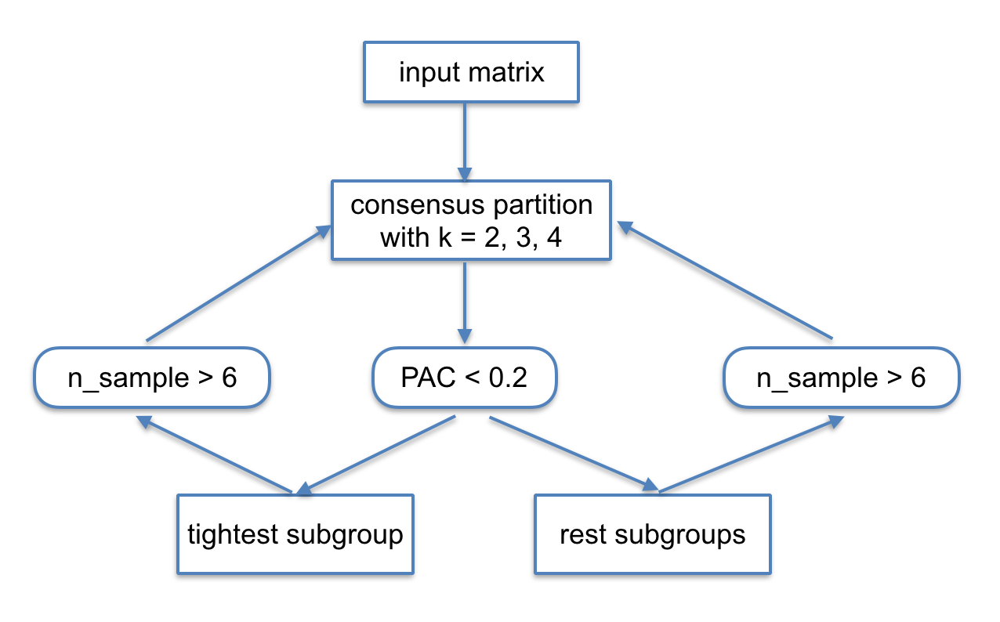

<!--
%\VignetteEngine{knitr}
%\VignetteIndexEntry{A Framework for Consensus and Hierarchical Partition}
-->

cola: A General Framework for Consensus and Hierarchical Partition
=============================================================

**Author**: Zuguang Gu ( z.gu@dkfz.de )

**Date**: `r Sys.Date()`

**Package version**: `r installed.packages()["cola", "Version"]`

-------------------------------------------------------------

```{r, echo = FALSE, message = FALSE}
library(markdown)
options(markdown.HTML.options = c(options('markdown.HTML.options')[[1]], "toc"))

library(knitr)
knitr::opts_chunk$set(
    error = FALSE,
    tidy  = FALSE,
    message = FALSE,
    fig.align = "center")
options(markdown.HTML.stylesheet = "custom.css")

options(width = 100)
library(ComplexHeatmap)
library(circlize)
library(cola)
```

## Introduction

Subgroup classification is a basic task in high throughput data analysis,
especially for gene expression and methylation data analysis. Mostly
unsupervised clustering methods are applied and it predicts new subgroups or
tests the consistency with known clinical annotations.

To get a stable classification of subgroups, [consensus
clustering](https://en.wikipedia.org/wiki/Consensus_clustering) or consensus
partition is always performed. It repeatedly clusters samples with a randomly
sampled subset of data and checks the robustness of the clustering, finally
gives a consensus classification of all samples.

Here we present the **cola** package which provides a general framework for
consensus partition. It has following advantages:

1. It modulizes the consensus clustering processes that variaty of methods can
   be easily integrated.
2. It provides rich visualizations for intepreting the results.
3. It allows running multiple methods at the same time and provides
   functionalities to compare results in a straightforward manner.
4. It provides a new method to extract features which are more efficient to
   separate subgroups.
5. It allows doing partition in a hierarchical way to detect subgroups
   with relatively smaller difference.
6. It generates detailed reports for the whole analysis.

Following flowchart lists the general steps of consensus partition implemented by **cola**:


The steps are:

1. Clean the input matrix, such as adjusting outliers and imputing missing
   values.
2. Extract subset of rows with highest scores. Here "scores" are calculated by a
   certain method. For gene expression analysis or methylation data analysis,
   $n$ rows with highest variance are always used. Here the "method", or let's
   call it "the top-value method" is the variance. However the choice of "the
   top-value method" can be general. It can be e.g. MAD (median absolute
   deviation) or any user-defined method.
3. Rows in the matrix with top rows are scaled (e.g. gene expression) or not
   scaled (e.g. methylation data).
4. Random sample a subset of rows from the matrix with probability $p$ and perform partition on
   the columns of the matrix by a certain partition method, with trying
   different numbers of subgroups.
5. Repeat step 4 several times and collect all the partitions.
6. Perfrom consensus partition analysis and determine the best number of
   subgroups which gives the most stable subgrouping.
7. Apply statistical tests to find rows that show significant difference between
   the predicted subgroups. E.g. to extract subgroup specific genes.
8. If rows in the matrix can be associated to genes, downstream analysis such
   as function enrichment analysis can be performed.

All the steps will be discussed in detail in following sections.

## Clean the matrix

In following part of this vignette, we call the columns of the matrix as
"samples".

Before doing consensus partition, a simple but important step is to clean the
input matrix:

```{r, eval = FALSE}
data = adjust_matrix(data)
```

`adjust_matrix()` does following preprocessing:

1. Rows where more than 25% of the samples having `NA` values are removed;
2. Use `impute::impute.knn()` to impute missing data if there is any;
3. For each row in the matrix, it uses `adjust_outlier()` (also provided by
   **cola** package) to adjust outliers. Values larger than the 95^th
   percentle or less than the 5^th percentle are replaced by corresponding
   percentiles.
4. Rows with zero variance are removed.
5. Rows with variance less than 5^th percentile of all row variance (after
   removing rows with zero variance) are removed.

Some of the above steps are optional. For example, methylation matrix does not
need to be adjusted for outliers because all the methylation values are
already in a fixed data scale (0 ~ 1).

## Basic usage

`consensus_partition()` performs consensus partition for a single top-value
method and a single partition method. The major arguments for
`consensus_partition()` are:

```{r, eval = FALSE}
res = consensus_partition(data,
    top_value_method = "MAD",
    top_n = c(1000, 2000, 3000, 4000, 5000),
    partition_method = "kmeans",
    max_k = 6,
    p_sampling = 0.8,
    partition_repeat = 50,
    anno = NULL)
``` 

- `data`: a data matrix where subgroups are found by columns.
- `top_value_method`: name of the method to assign values to rows in the
  matrix. Later these values are used to order and extract rows with top
  values.
- `top_n`: number of rows with top values used for partition. Normally we try
  a list of different ones.
- `partition_method`: name of the method for partition.
- `max_k`: max number of subgroups to try. It will try from 2 to `max_k`.
- `p_sampling`: proportion of the `top_n` rows to sample. The sub-matrix with
  `p_sample * top_n` rows is used for partition.
- `partition_repeats`: times of random sampling and partitions to perform.
- `anno`: a vector or a data frame which contains known annotations of
  samples. If it is provided, it will drawn along side with the predicted
  subgroups in the plot generated by downstream functions and it can also be
  tested for the correlation to predicted subgroups.

Other arguments can be found in the on-line documentation of
`consensus_partition()`.

In most of the cases, we want to try different top-value methods and different
partition methods to see which combination of methods gives the best prediction.
The helper function `run_all_consensus_partition_methods()` is a convinient
way for doing this:

```{r, eval = FALSE}
rl = run_all_consensus_partition_methods(data, 
	top_value_method = c("sd", "MAD", ...),
	partition_method = c("hclust", "kmeans", ...),
	mc.cores = ...)
```

There are functions in **cola** package that can visualize and compare the
results for all combinations of methods simutanuously.

## Top-value methods

Top-value methods are used to assign scores to rows in the matrix, later the
scores are ordered and only the top $n$ rows with the highest scores are used for
consensus partition. The default top-value methods provided in the package
are:

```{r}
all_top_value_methods()
```

These top methods are:

- `sd`: Standard deviation.
- `cv`: [Coefficient of
  variance](https://en.wikipedia.org/wiki/Coefficient_of_variation), defined
  as `sd/(mean + s0)` where `s0` is a penalty term which is the 10^th
  percentile of all row means to avoid small values dividing small values
  giving large values.
- `MAD`: [Median absolute
  deviation](https://en.wikipedia.org/wiki/Median_absolute_deviation).
- `AAC`: A new method proposed in **cola** package and it will be explained later
  in this section.

These methods can be used in consensus partition by providing the name.

You can register a new top-value method by `register_top_value_method()`. The
value should be functions. For each function, it should only have one
argument which is the matrix for analysis and it must return a vector with
scores for rows. In following example, the "max" method uses the row maximum
as the row score and we also add the "QCD" ([quartile coefficient of
dispersion](https://en.wikipedia.org/wiki/Quartile_coefficient_of_dispersion))
method as a second method here.

```{r}
register_top_value_method(
	max = function(mat) rowMaxs(mat),
	QCD = function(mat) {
		qa = matrixStats::rowQuantile(mat, probs = c(0.25, 0.75))
		(qa[, 2] - qa[, 1])/(qa[, 2] + qa[, 1])
	})
all_top_value_methods()
```

By default the consensus partition functions use all registered top-value
methods, but still you can explicitly specify a subset of top-value methods.
To remove registered top-value methods, simply use `remove_top_value_method()`
by providing a vector of names.

```{r}
remove_top_value_method(c("max", "QCD"))
```

### The AAC method

Choosing the top rows in the matrix is important for the subgroup
classification. In most of the cases, we extract the most variable rows which
is defined by row variance. However, sometimes it won't give you meaningful
rows which are efficient for subgroup classification. When random noise in the
data increases, e.g. for single cell RNASeq data, the most variable genes are
too weak to detect any stable subgroups.

If we think reversely, assuming there exist stable subgroups in the data,
there must be groups of rows showing similar pattern to support the
subgrouping, in other words, rows in the same groups should have high
correlations to each other. Thus, if we can get rows that more correlate to
others, they are more strong to form a stable subgroup for the samples.
According to this thought, we designed the AAC method.

For row $i$ in a matrix, $X$ is a vector of the absolute correlation to all other rows,
the AAC (area above the correlation CDF curve) for row $i$ is defined as:

$$AAC_i = 1 - \int_0^1F(x)$$

where $F(x)$ is the empirical CDF (cumulative distribution function) of $X$.

In following plot, the line is the CDF curve. AAC is the area above the CDF
curve. It can be imagined that when row $i$ correlates with more other rows,
the CDF curve shifts more to the right, thus with higher AAC scores.

```{r, echo = FALSE, fig.width = 5, fig.height = 5}
source("AAC.R")
par(mar = c(4, 4, 1, 1))
AAC_definition()
```

Next we perform a simulation test to show the attributes of AAC. A matrix with
160 rows with random values are generated as follows:

1. 100 rows with mean of 0, covariance of 0 with 1 on the diagnal;
2. 10 rows with mean of 0, covariance of 0.8 with 1 on the diagnal;
3. 50 rows wiht mean of 0, covaraince of 0.5 with 1 on the diagnal.

In the left figure in following, they are ECDF curves of the correlation when
calculating AAC scores. The middle figure is the AAC for all 160 rows and the
right figure is the standard deviation for the 160 rows.

```{r, echo = FALSE, fig.width = 12, fig.height = 4}
AAC_simulation()
```

All the 160 rows have theretical variance of 1 that they cannot be
distinguished very well by using variance. As a contrast, the rows with
covariance have higher AAC values, even higher when the number of correlated
rows increases (although the correlation value itself is small). This shows
AAC method can assign higher values for rows which have wide-range correlation
patterns.

## Partition methods

Partition methods are used to separate samples into $k$ subgroups where $k$ is
a known parameter for the partition. The default partition methods are:

```{r}
all_partition_methods()
```

These partition methods are:

- `hclust`: hierarchical clustering + cutree.
- `kmeans`: k-means clustering.
- `skmeans`: spherical k-means clustering, from **skmeans** package.
- `pam`: partitioning around medoids, from **cluster** package.
- `mclust`: model-based clustering, from **mclust** package. The clustering is based on
  the first three principle dimension from the original matrix.

Similarly, you can register a new partition method by
`register_partition_method()`. The value is should be functions with two
arguments which are the input matrix and number of partitions. There can be a
third argument for the function which is  `...` used for passing more
arguments from the main partition functions. The function should only return a
vector of subgroup/class labels. **Please note the partition is applied on
columns of the matrix and the number of unique levels of subgroup levels which
are predicted by the partition method are not necessarily to be the same as
$k$.**

Following example registers a partition method which randomly assign subgroup
labels to samples:

```{r}
register_partition_method(random = function(mat, k) {
	sample(letters[1:k], ncol(mat), replace = TRUE)
})
```

Here the subgroup labels can be in any types (numbers, characters). They only
need to be different for different classes. These labels will be re-encoded
with numeric indices internally.

To remove a partition method, use `remove_partition_method()`:

```{r}
remove_partition_method("random")
```

### The skmeans method

The skmeans method ([the spherical k-means
clustering](https://www.jstatsoft.org/article/view/v050i10)) is powerful to
detect subgroups where samples in a same subgroup show strong correlations.
skmeans clustering uses cosine similarity and projects data points onto a unit hyper-sphere.
As we have tested for many datasets, skmeans is very efficient to detect stable subgroups.


## Consensus clustering

For a given number of top rows $n_i$, the corresponding matrix with top rows
denoted as $M_i$, a subset of rows with probability of $p$ are randomly
sampled from $M_i$ and a certain partition method is applied on it, generating
a partition $P_a$. In most of cases, we have no prior knowledge of which $n_i$
gives better results, thus, **cola** allows to try multiple $n_i$ and put
partitions from all $n_i$ together to find a consensus subgrouping. Let's
assume top rows are tried for $n_1$, $n_2$, ..., $n_m$ and the randomly
sampling is performed for $N_s$ times, then, for a given number of subgroups
for trying, the total number of partitions is $N_P = m*N_s$.

### Consensus matrix

The consensus matrix measures how consistently two samples are in a same
subgroup and it can be used to visualize or analysis the stability of the
subgrouping. The value $c_{ij}$ in the consensus matrix is the probability of
sample $i$ and sample $j$ in a same subgroup in all $N_P$ partitions. It is
calculated as:

$$c_{ij} = \sum_a^{N_p}I(s_{ia}, s_{ja})/N_P$$

where $s_{ia}$ is the subgroup label for sample $i$ in partition $a$ and $I()$
is the identity function there $I(x = y) = 1$ and $I(x \neq y) = 0$.

Following two heatmaps visualize two consensus matrices. The left one shows
less stability of subgrouping than the right one, while for the right one,
there are three very obvious blocks in the diagnal that in each block, the
corresponding samples are likely all in a same subgroup.

```{r, echo = FALSE, fig.width = 9, fig.height = 4}
data(cola_rl)
m1 = get_consensus(cola_rl["sd:kmeans"], k = 2)
m2 = get_consensus(cola_rl["sd:kmeans"], k = 3)
grid.newpage()
pushViewport(viewport(layout = grid.layout(nr = 1, nc = 2)))
pushViewport(viewport(layout.pos.row = 1, layout.pos.col = 1))
draw(Heatmap(m1, name = "matrix1", show_row_dend = FALSE, show_column_dend = FALSE, col = colorRamp2(c(0, 1), c("white", "blue"))), show_heatmap_legend = T, newpage = FALSE, padding = unit(c(5, 5, 5, 5), "mm"))
popViewport()
pushViewport(viewport(layout.pos.row = 1, layout.pos.col = 2))
draw(Heatmap(m2, name = "matrix2", show_row_dend = FALSE, show_column_dend = FALSE, col = colorRamp2(c(0, 1), c("white", "blue"))), show_heatmap_legend = T, newpage = FALSE, padding = unit(c(5, 5, 5, 5), "mm"))
popViewport(2)
```

### Consensus subgroup labels

As long as we have a list of $N_P$ partitions for a given subgroup number $k$,
we need to find a consensus partition based on all $N_P$ partitions. Simply
speaking, the consensus subgroup label for sample $i$ should be the one which
have the maximal occurency among all partitions.

Internally, **cola** package uses the **clue** package to construct the
"partition ensemble" and predict the consensus subgroups. The "SE" method from
`clue::cl_consensus()` function (please check the online documentation of this
function) are used to calculate the consensus subgroup labels.

### Adjust subgroup labels

The subgroup labels are assigned with numeric indices (1, 2, ...), however, in
each partition, the assignment of the labels can be random, e.g. one same
subgroup can be assigned with 1 in one partition, while in the other
partition, it can be 2, but they are all identical for the sense of
subgrouping. E.g. following partitions are all identical:

```
1 1 1 1 1 1 1 2 2 2 2 2 2
2 2 2 2 2 2 2 1 1 1 1 1 1
a a a a a a a b b b b b b
```

The subgroups are indentical if switching the group label. This group label
adjustment is called the linear sum assignment problem, which is solved by the
`solve_LSAP()` function in **clue** package. The aim is to find a mapping `m()`
between two sets of labels to minimize $\sum I(s_{1i}, m(s_{2i}))$ where $s_1$ is
the first label set and $s_2$ is the second label set.

In following example, if the mapping is `1 -> 2, 2 -> 1`, the second partition
in following

```
1 1 1 1 1 1 1 2 2 2 2 2
2 2 2 2 2 1 1 1 1 1 1 1
```

is adjusted to

```
1 1 1 1 1 1 1 2 2 2 2 2
1 1 1 1 1 2 2 2 2 2 2 2   # switch 1 <-> 2
```

For the subgroup predicted by `clue::cl_consensus()`, the labels are
additionally adjusted by the average distance in each subgroup (calculated
from the original matrix), which means, the subgroup with label 1 always has
the smallest intra-distance.

This subgroup label adjustment is frequently used in **cola** to help the
visualization as well as downstream analysis.

### Membership matrix 

The $N_P$ partitions are stored as a membership matrix where rows are
partitions (grouped by the number of top rows) and all the subgroup labels are
adjusted according to the consensus subgroups. Following heatmap is a
visualization of all partitions and correspondance to the consensus partition.
The "p\*" annotation on top of the heatmap is the probability of being in
subgroup $i$ across all partitions.

```{r, echo = FALSE}
membership_heatmap(cola_rl["sd:hclust"], k = 3)
```

## Determine the best number of subgroups

Consensus partition is applied with a specified number of subgroups (we termed
it as $k$). Normally, a list of $k$ are tried to find the best $k$. **cola**
provides following metrics to help to determine the best number of subgroups:

The `get_stat()` function returns statistics for all metrics mentioned below
and `select_partition_number()` plots the statistics with the number of
subgroups.

### Cophenetic correlation

It measures if hierarchical clustering is applied on the consensus matrix, how
good it correlates to the consensus matrix itself
(https://en.wikipedia.org/wiki/Cophenetic_correlation). With higher the value,
better the $k$.

### Silhouette score

[The silhouette
scores](https://en.wikipedia.org/wiki/Silhouette_%28clustering%29) measures
how close one sample is in its own subgroup compared to the closest
neighbouring subgroup. For sample $i$, the mean distance to all subgroups are
calculated, denoted as $d_1$, $d_2$, ..., $d_k$. The distance to the subgroup
where sample $i$ stays is denoted as $d_a$ and the sihouette score is defined
as:

$$silhouette_i = 1 - d_a/d_b$$

where $d_b$ is the minimal distance excluding $d_a$:

$$d_b = min_{j \neq a}^k d_j$$

Following plot illustrates how silhouette score is calculated.

```{r, echo = FALSE, fig.width = 6, fig.height = 5}
source("silhouette.R")
```

The mean silhouette score from all samples is used to choose the best $k$ where
higher the mean silhouette score, better the $k$.

### PAC score

[The PAC score](https://en.wikipedia.org/wiki/Consensus_clustering#Over-interpretation_potential_of_consensus_clustering) measures the proportion of
the ambiguous subgrouping. If the subgrouping is stable, in $N_P$ partitions,
sample $i$ and sample $j$, in most of the cases, are either always in a same
subgroup, or always in different subgroups, which results in that, in the
consensus matrix, the values are, in most of the cases, close to 1 or 0. Then
in the CDF of the consensus matrix, the curve will be very flatterned between
$x_1$ and $x_2$ where $x_1$ is very close to 0 and $x_2$ is very close to 1
because there are very few values between $x_1$ and $x_2$. And then $F(x_2) -
F(x_1)$ can be used to measure how much the ambiguous subgrouping is.

```{r, echo = FALSE, fig.width = 14, fig.height = 14/3}
m1 = get_consensus(cola_rl["sd:kmeans"], k = 2)
m2 = get_consensus(cola_rl["sd:kmeans"], k = 3)

grid.newpage()
pushViewport(viewport(layout = grid.layout(nr = 1, nc = 3)))
pushViewport(viewport(layout.pos.row = 1, layout.pos.col = 1))
draw(Heatmap(m1, name = "matrix1", show_row_dend = FALSE, show_column_dend = FALSE, col = colorRamp2(c(0, 1), c("white", "blue"))), show_heatmap_legend = T, newpage = FALSE, padding = unit(c(5, 5, 5, 5), "mm"))
popViewport()
pushViewport(viewport(layout.pos.row = 1, layout.pos.col = 2))
draw(Heatmap(m2, name = "matrix2", show_row_dend = FALSE, show_column_dend = FALSE, col = colorRamp2(c(0, 1), c("white", "blue"))), show_heatmap_legend = T, newpage = FALSE, padding = unit(c(5, 5, 5, 5), "mm"))
popViewport()

pushViewport(viewport(layout.pos.row = 1, layout.pos.col = 3))
f1 = ecdf(m1[upper.tri(m1, diag = FALSE)])
f2 = ecdf(m2[upper.tri(m2, diag = FALSE)])
pushViewport(viewport(xscale = c(0, 1), yscale = c(0, 1), x = unit(2, "cm"), y = unit(2, "cm"),
    just = c("left", "bottom"), width = unit(1, "npc") - unit(2.5, "cm"), height = unit(1, "npc") - unit(2.5, "cm")))
x = seq(0, 1, by = 0.01)
grid.lines(x, f1(x), gp = gpar(col = "red"))
grid.lines(x, f2(x), gp = gpar(col = "blue"))
grid.segments(c(0.1, 0.9), c(0, 0), c(0.1, 0.9), c(1, 1), gp = gpar(col = "grey", lty = 2))
grid.points(c(0.1, 0.9), f1(c(0.1, 0.9)), pch = 16, gp = gpar(col = "red"))
grid.points(c(0.1, 0.9), f2(c(0.1, 0.9)), pch = 16, gp = gpar(col = "blue"))
grid.xaxis(gp = gpar(fontsize = 10)); grid.text("x", x = 0.5, y = unit(-1.5, "cm"))
grid.yaxis(gp = gpar(fontsize = 10)); grid.text("P(X <= x)", x = unit(-1.5, "cm"), y = 0.5, rot = 90)
upViewport(2)
```

In the original implementation of PAC, $x_1$ and $x_2$ are fixed (e.g. 0.1 and
0.9). But in many cases, the choice of $x_1$ and $x_2$ is quite sensitive,
thus, in **cola** package, the PAC implementation is a slightly changed to its
orignal implementation. For following form of PAC:

$$PAC_a = F(x_2) - F(x_1)$$

$x_1$ takes a list of values from $[0.1, 0.3]$ and $x_2$ takes a list of values
in $[0.7, 0.9]$. The final PAC score is the mean of $PAC_a$ by removing the
top 10^th and bottom 10^th values. This method improves the robustness of
choosing $x_1$ and $x_2$.

Smaller the PAC score, better the $k$.

### Concordance

The concordance of partitions to the consensus partition is calculated as,
for each partition $a$, the probability that it fits the consensus partition:

$$c_{a} = \sum_i^{N_s}I(s_{ia} = sc_i)/N_s$$

where $N_s$ is the number of samples and $sc$ is the consensus subgroup label.

The final concordance score is the mean value of $c_a$. Higher the concordance score, better the $k$.

### Area increased 

It is the increased area under CDF compared to the previous $k$.

$$A_k = \int F_k(x) - \int F_{k-1}(x)$$

and when $k = 2$ or for the minimal $k$:

$$A_k = \int F_k(x)$$

In follow example, there are five consensus heatmaps corresponding to $k = 2..6$:

```{r, echo = FALSE, fig.width = 14, fig.height = 14/5}
grid.newpage()
pushViewport(viewport(layout = grid.layout(nr = 1, nc = 5)))
for(k in 2:6) {
    m = get_consensus(cola_rl["sd:kmeans"], k = k)
    pushViewport(viewport(layout.pos.row = 1, layout.pos.col = k-1))
    draw(Heatmap(m, show_row_dend = FALSE, show_column_dend = FALSE, 
        col = colorRamp2(c(0, 1), c("white", "blue"))), show_heatmap_legend = FALSE, 
        newpage = FALSE, column_title = paste0("k = ", k))
    popViewport()
}
popViewport()
```

The corresponding CDF curves and the area increased are:

```{r, echo = FALSE, fig.width = 10, fig.height = 5}
par(mfrow = c(1, 2))
plot_ecdf(cola_rl["sd:kmeans"], lwd = 1)
area_increased = get_stat(cola_rl["sd:kmeans"])[, "area_increased"]
plot(2:6, area_increased, type = "b", xlab = "k", ylab = "area increased")
```

The $k$ before the elbow is taken as the best $k$ (in above example it is 3).
Basically when $k$ reaches a stable subgrouping, increasing $k$ won't change
the consens matrix too much, which results in less change of the difference of
area under the CDF curve.

### Rand index 

In some cases, when number of subgroups changes from $k-1$ to $k$, all the
statistics imply $k$ is a better choisce than $k-1$. However, when observing
the consensus heatmap, basically it is because a very small set of samples are
separated to form a new subgroup and in many cases, they are outlier samples.
In this case, it is better to still keep $k-1$ subgroups. Or in other words,
the subgrouping with $k$ is similar as $k-1$ and it is not worth to increase
$k$ from $k-1$. In **cola** package, there are two metrics Rand index and
Jaccard index to measure the similarity of two partitions for $k-1$ and
$k$. The two metrics are calculated by `clue::cl_agreement(..., method =
"Rand")` or `clue::cl_agreement(..., method = "Jaccard")`.

For all pairs of samples, denote following symbols
(https://en.wikipedia.org/wiki/Rand_index#Definition):

- $a$: the number of pairs of samples that are in the same subgroup in $k$ and
  in the same subgroup in $k-1$
- $b$: the number of pairs of samples that are in the different subgroup in
  $k$ and in the different subgroup in $k-1$
- $c$: the number of pairs of samples that are in the same subgroup in $k$ and
  in the different subgroup in $k-1$
- $d$: the number of pairs of samples that are in the different subgroup in
  $k$ and in the same subgroup in $k-1$

the Rand index which is the percent of pairs of samples that are both in a
same cluster or both are not in a same cluster in the partition of k and k-1.

$$Rand = \frac{a+b}{a+b+c+d}$$

If Rand index is too high, it means the subgrouping is very similar and not
sufficient to increase from $k-1$ to $k$.

### Jaccard index

The Jaccard index is the ratio of pairs of samples that are both in a same subgroup
in the partition of $k$ and $k-1$ and the pairs of samples are both in a same
subgroup in the partition of $k$ or $k-1$.

$$Jaccard = \frac{a}{a+c+d}$$

### Rule

**cola** provides a `guess_best_k()` function which determines the best $k$.
It is based on following rules:

- All $k$ with Rand index larger than 0.95 are removed because the increase of
  the partition number does not provides enough extra information.
- For $k$ with cophenetic correlation coefficient larger than 0.99 or PAC
  score less than 0.1 or concordance score larger than 0.95, the maximal $k$
  is taken as the "best k".
- If it does not fit the second rule. The $k$ with maximal vote of highest
  cophenetic correlation coefficient, lowest PAC score, highest mean
  silhouette and highest concordance is taken as the "best k".

## Find signatures

As long as there are stable subgroups, we can look for rows which show
distinct difference in one subgroup compared to others. They can be called
signature genes or signature probes if the corresponding dataset is gene
expression data or methylation data.

By default, samples with silhouette scores less than 0.5 are removed. **cola** provides
following methods:

- `ttest`: First it looks for the subgroup with highest mean value, compare to
  each of the other subgroups with t-test and take the maximum p-value. Second
  it looks for the subgroup with lowest mean value, compare to each of the
  other subgroups again with t-test and take the maximum p-values. Later for
  these two list of p-values take the minimal p-value as the final p-value.
- `samr` and `pamr`: use SAM/PAM method to find significantly different rows between
  subgroups.
- `Ftest` use F-test to find significantly different rows between subgroups.

Users can also provide their own method by providing a function with the matrix and subgroup labels
as input, 

## Compare multiple methods

`consensus_partition()` is the core function for doing consensus partition.
But it can only perform analysis with a single top-value method and a single
partition method. In most of the cases, we have no idea of which combination
of top-value method and partition method gives better results. Here
`run_all_consensus_partition_methods()` can perform anlaysis with multiple
methods:

```{r, eval = FALSE}
rl = run_all_consensus_partition_methods(...)
```

By default it runs analysis for all combinations of top-value methods in
`all_top_value_methods()` and partition methods in `all_partition_methods()`.

**cola** package provides functions to collect plots from all combinations of
methods for straightforward comparisons.

```{r, eval = FALSE}
collect_plots(rl, fun = consensus_heatmap, k = ...)
collect_plots(rl, fun = membership_heatmap, k = ...)
collect_plots(rl, fun = get_signatures, k = ...)
```

And `collect_classes()` compares consensus partition from all methos:

```{r, eval = FALSE}
collect_classes(rl, k = ...)
```

When runnig `run_all_consensus_partition_methods()`, there are consensus
partition for each combination of the methods. To compare partitions from
different method, there is a ultimate consensus partition which is calcualted from all
methods by weighting the mean silhouette scores. And for each combination of
methods, the subgroup labels are adjusted by the ultimate consensus subgroup.

## Visualizations

**cola** package provides rich visualizations for the results generated by a
single method or multiple methods.

### On the ConsensusPartition object

The object which is generated with a single top-value method and a single
partition method belongs to the class `ConsensusPartition`. There are several
visualization functions that can be applied to it.
 `select_partition_number()` makes several plots to show
different statistics along with different $k$, which helps to determine the
"best k".

```{r, fig.width = 8, fig.height = 8}
rl = readRDS("~/cola_test/TCGA_subgroup.rds")
res = rl["MAD:kmeans"] # the ConsensusPartition object
select_partition_number(res)
```

The heatmap for the consensus matrix with a certain $k$:

```{r}
consensus_heatmap(res, k = 4, show_row_names = FALSE)
```

The heatmap for the membership matrix with a certain $k$:

```{r}
membership_heatmap(res, k =4)
```

The PCA plot under the subgroups with a certain $k$:

```{r}
dimension_reduction(res, k = 4)
```

The heatmap for the signature rows with a certain $k$. The heatmap is split
into two parts by columns. The left heatmap contains samples with silhouette
scores larger than 0.5 and the right heatmap contains samples with silhouette
scores less than 0.5.

```{r, results = "hide"}
get_signatures(res, k = 4, show_column_names = FALSE)
```

`collect_classes()` which is applied on the `ConsensusPartition` object
visualizes how subgroups are corresponded with increasing $k$:

```{r}
collect_classes(res, show_row_names = FALSE)
```

`collect_plots()` which is applied on the `ConsensusPartition` object puts
all the plots from all $k$ into one single page.

```{r, results = "hide", fig.width = 14, fig.height = 14/5*4}
collect_plots(res)
```

### On the ConsensusPartitionList object

`run_all_consensus_partition_methods()` returns a `ConsensusPartitionList` object.
There are two main functions which can visualize results from all combinations
of methods and compare directly.

```{r, fig.width = 14, fig.height = 14/5*4, results = "hide"}
collect_plots(rl, fun = consensus_heatmap, k = 4)
```

`fun` can also be `membership_heatmap` or `get_signatures` that membership heatmap
and signature heatmap for each method will be plotted.

`collect_classes()` which is applied on the `ConsensusPartitionList` object plots 
the partition for each combination of methods and the lightness correspond to the 
silhouette scores for samples in each method. Rows are clustered by the dissimilarity
measurement from `clue::cl_dissimilarity(..., method = "comembership")`. On top the
consensus subgroup is inferred from all methods by taking the mean silhouette scores
as weight.

```{r, fig.width = 10}
collect_classes(rl, k = 4)
```

## A Real example

In this example, we use [the TCGA GBM microarray data set](https://www.ncbi.nlm.nih.gov/pubmed/20129251)
where four subtypes is predicted.
The two files (`unifiedScaled.txt` and `TCGA_unified_CORE_ClaNC840.txt`) for use is from 
[here](https://tcga-data.nci.nih.gov/docs/publications/gbm_exp/).

Following code is used to perform analysis of consensus partition.

```{r, eval = FALSE}
data = read.table("~/cola_test/unifiedScaled.txt", header = TRUE, 
    row.names = 1, check.names = FALSE)
data = as.matrix(data)

subtype = read.table("~/cola_test/TCGA_unified_CORE_ClaNC840.txt", 
    sep = "\t", header = TRUE, check.names = FALSE, stringsAsFactors = FALSE)
subtype = structure(unlist(subtype[1, -(1:2)]), names = colnames(subtype)[-(1:2)])

data = data[, names(subtype)]

data = adjust_matrix(data)
rl = run_all_consensus_partition_methods(data, top_n = c(1000, 2000, 3000, 4000), 
    max_k = 6, mc.cores = 4, anno = data.frame(subtype = subtype), 
    anno_col = list(subtype = structure(seq_len(4), names = unique(subtype))))
```

Simply type `rl` gives a summary of the analysis:

```{r}
rl
```

`cola_report()` function generates a detailed report (with all the tables and
plots) for this analysis which can be visited at https://jokergoo.github.io/cola_files/tcga_cola_rl_report/cola_report.html.

```{r, eval = FALSE}
cola_report(rl, output_dir = "~/cola_test/tcga_cola_rl_report")
```

## Hierarchical partition

Normal consensus partition methods aim to find $k$ subgroups at the same time. However, when
1. there are dominant subgroups, or 2. the number of potential subgroups are large, it is 
difficult to find secondary subgroups which show less difference with normal consensus partition
process. To solve this problem, the subgroups can be found in a hierarchical way, where dominant
subgroups are found first, later secondary subgroups are detected.

**cola** package implements hierarchical partition and the flowchart is as follows.



Generally, at each recursive step, the consensus partition is performed for a
small set of $k$ (because the final larger number of subgroups will be
detedted hierarchically) and a subset of samples, If the PAC score of the
"best k" is less than 0.15, the samples are split into two subgroups where the
first subgroup contains samples with smallest intra-group mean distance and
the second subgroups are all other samples. For each of the two subgropus, if
the number of samples is less than 6, the hierarchial partition stops, or it
repeatedly perform the hierarchial partition on the subset of samples in the
corresponding subgroups.

Hierarchical partition is performed by `hierarchical_partition()` function.
Here you can only use one single top-value method and a single partition
methods.

In following example, we still use the TCGA GBM microarray datasets. The
consensus partition which is summarized from all methods are added as an
annotation to compare to the subgroups predicted by hierarchical partition.

```{r, eval = FALSE}
rh = hierarchical_partition(data, top_n = c(1000, 2000, 3000, 4000),
    top_value_method = "MAD", partition_method = "kmeans",
    anno = data.frame(subtype = subtype,
        consensus = get_classes(rl, k = 4)$class), 
    anno_col = list(subtype = structure(seq_len(4), names = unique(subtype)),
        consensus = structure(brewer.pal(4, "Set1"), names = 1:4)))
```

```{r, echo = FALSE}
rh = readRDS("~/cola_test/TCGA_subgroup_hierarchical_partition.rds")
```

Simply typing `rh` gives summary of the analysis.

```{r}
rh
```

**cola** uses a special way to encode the node in the hierarchy. The length of the node name
is the depth of the node in the hierarchy and the substring excluding the last digit is the name
node of the parent node. E.g. for the node `0011`, the depth is 4 and the parent node is `001`.

`collect_classes()` plots the hierarchial of subgroups as well as the annotations set before.

```{r}
collect_classes(rh)
```

In above plot, generally hierarchical partition found similar subgroups as
consensus partition, but hierarchical partition additionally found two
subgroups for the Mesenchymal subtype samples, or subgroup 1 in consensus
partition (the `rl` object), which makes totally 5 subgroups. However, if we
directly check the 5 subgroups in `rl`, actually the subgrouping is not
stable. This means the difference between the two subgroups in Mesenchymal is
so small that it cannot be distinguished if we consider all samples in the
analysis.

```{r}
consensus_heatmap(rl["MAD:kmeans"], k = 5, show_row_names = FALSE)
```

In the hierarchical partition, the two subgroups of Mesenchymal subtype are
under the node `001`. If only applying consensus partition on node `001`,
actually there are two obvious subgroups and there are quite a lot signature
genes which are significantly different between the two subgroups. This proves
it is very meanningful that there are two secondary subgroups in Mesenchymal subtype.

```{r, results = "hide"}
get_signatures(rh["001"], k = 2, show_column_names = FALSE)
```

Similar as the `ConsensusPartitionList` object, `cola_report()` function
can also be applied to this `HierarchicalPartition` object. The full report
for `rh` can be found at https://jokergoo.github.io/cola_files/tcga_cola_rh_report/cola_report.html.

```{r, eval = FALSE}
cola_report(rh, output_dir = "~/cola_test/tcga_cola_rh_report")
```

## Session info

```{r}
sessionInfo()
```
