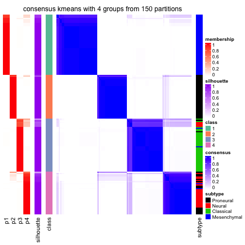
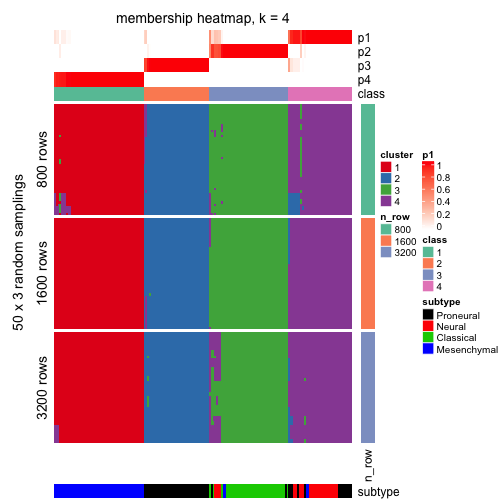
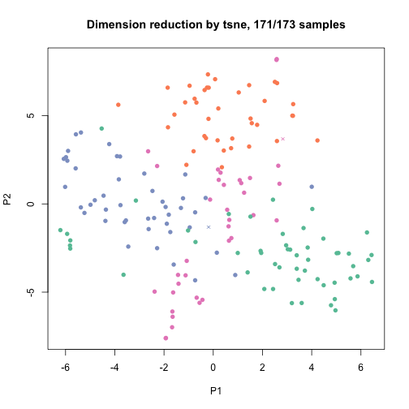

```r
library(cola)
```

Data is from https://tcga-data.nci.nih.gov/docs/publications/gbm_exp/.


```r
data = read.table("~/analysis/unifiedScaled.txt", 
	header = TRUE, row.names = 1, check.names = FALSE)
data = as.matrix(data)

subtype = read.table("~/analysis/TCGA_unified_CORE_ClaNC840.txt", 
	sep = "\t", header = TRUE, check.names = FALSE, stringsAsFactors = FALSE)
subtype = structure(unlist(subtype[1, -(1:2)]), names = colnames(subtype)[-(1:2)])

data = data[, names(subtype)]
dim(data)
```

```
## [1] 11861   173
```

```r
table(subtype)
```

```
## subtype
##   Classical Mesenchymal      Neural   Proneural 
##          38          56          26          53
```

Get all supported top methods and partition methods:


```r
all_top_value_methods()
```

```
## [1] "sd"  "vc"  "MAD" "AAC"
```

```r
all_partition_methods()
```

```
## [1] "hclust"  "kmeans"  "skmeans" "pam"     "mclust"  "som"
```


```r
register_top_value_fun(AAC = function(mat) AAC(t(mat), mc.cores = 4))
```

Run clustering for all combination of methods in batch:


```r
res = run_all_consensus_partition_methods(data, top_n = c(1000, 2000, 4000), k = 2:6, mc.cores = 4,
	known_anno = data.frame(subtype = subtype), 
	known_col = list(subtype = structure(seq_len(4), names = unique(subtype))))
```


```r
res_list = readRDS("~/analysis/TCGA_subgroup_p0.8.rds")
res_list
```

```
## Top rows are extracted by 'sd, vc, MAD, AAC' methods.
## Subgroups are detected by 'hclust, kmeans, skmeans, pam, mclust, som' method.
## Number of partitions are tried for k = 2, 3, 4, 5, 6
## 
## Following methods can be applied to this 'ConsensusPartitionList' object:
##  [1] "collect_classes"       "collect_plots"        
##  [3] "get_best_k"            "get_class"            
##  [5] "get_single_run"        "get_stat"             
##  [7] "show"                  "test_to_known_factors"
##  [9] "top_rows_heatmap"      "top_rows_overlap"
```


```r
get_best_k(res_list)
```

```
##             best_k
## sd:hclust        5
## sd:kmeans        4
## sd:skmeans       3
## sd:pam           2
## sd:mclust        2
## sd:som           6
## vc:hclust        2
## vc:kmeans        2
## vc:skmeans       2
## vc:pam           6
## vc:mclust        2
## vc:som           2
## MAD:hclust       6
## MAD:kmeans       4
## MAD:skmeans      3
## MAD:pam          2
## MAD:mclust       2
## MAD:som          5
## AAC:hclust       2
## AAC:kmeans       4
## AAC:skmeans      2
## AAC:pam          2
## AAC:mclust       4
## AAC:som          2
```

Collect all plots for a k:


```r
collect_plots(res_list, k = 4, fun = plot_ecdf)
```


```r
collect_plots(res_list, k = 4, fun = consensus_heatmap)
```


```r
collect_plots(res_list, k = 4, fun = membership_heatmap)
```


```r
# collect_plots(res_list, k = 3, fun = get_signatures)
```


```r
get_stat(res_list, k = 4)
```

```
##               cophcor        PAC mean_silhouette tot_withinss
## sd:skmeans  0.9906137 0.02968928       0.9464913     515908.2
## vc:skmeans  0.9017396 0.22034469       0.5986908     573383.6
## MAD:skmeans 0.9917202 0.04082307       0.9416860     515334.7
## AAC:skmeans 0.9862311 0.04698665       0.9109214     480534.7
## sd:mclust   0.9540665 0.20498328       0.7725828     530099.1
## vc:mclust   0.8788979 0.34129738       0.3831299     585009.8
## MAD:mclust  0.9714823 0.16010806       0.8263652     524369.5
## AAC:mclust  0.9379502 0.20530836       0.7149018     491316.8
## sd:som      0.9029141 0.30497866       0.5950551     522486.5
## vc:som      0.8534312 0.38884375       0.5004420     583134.7
## MAD:som     0.9152981 0.28345050       0.6493733     516494.5
## AAC:som     0.8732074 0.30028905       0.5307280     476794.1
## sd:kmeans   0.9864947 0.05075043       0.9087373     514582.6
## vc:kmeans   0.8668875 0.28857438       0.4808597     574441.3
## MAD:kmeans  0.9942287 0.02951285       0.9504907     513463.6
## AAC:kmeans  0.9892245 0.06005070       0.9037369     472793.4
## sd:pam      0.9638108 0.10029471       0.8178506     530620.1
## vc:pam      0.9590619 0.16217010       0.7775741     583677.9
## MAD:pam     0.9605013 0.09343133       0.8184450     527160.4
## AAC:pam     0.9719577 0.08268118       0.8591456     485722.5
## sd:hclust   0.9100627 0.30063822       0.6277201     520785.7
## vc:hclust   0.8325430 0.37324069       0.4953497     586553.3
## MAD:hclust  0.8876709 0.30069146       0.5870465     518427.8
## AAC:hclust  0.8700467 0.32192792       0.5219177     481325.8
##             area_increased
## sd:skmeans       0.1231322
## vc:skmeans       0.1220629
## MAD:skmeans      0.1235317
## AAC:skmeans      0.1490348
## sd:mclust        0.1645847
## vc:mclust        0.3476139
## MAD:mclust       0.1789200
## AAC:mclust       0.1796712
## sd:som           0.1782378
## vc:som           0.2883496
## MAD:som          0.1826210
## AAC:som          0.1410970
## sd:kmeans        0.1374732
## vc:kmeans        0.1175851
## MAD:kmeans       0.1292581
## AAC:kmeans       0.1269365
## sd:pam           0.1514095
## vc:pam           0.1758968
## MAD:pam          0.1447458
## AAC:pam          0.1356981
## sd:hclust        0.2014055
## vc:hclust        0.2054728
## MAD:hclust       0.1773105
## AAC:hclust       0.1506691
```


```r
collect_classes(res_list, k = 4)
```


Overlap of top rows in different top methods:


```r
par(mfrow = c(1, 3))
top_rows_overlap(res_list, top_n = 1000)
top_rows_overlap(res_list, top_n = 2000)
top_rows_overlap(res_list, top_n = 4000)
```


Also visualize the correspondance of rankings between different scoreing methods:


```r
top_rows_overlap(res_list, top_n = 1000, type = "correspondance")
```


Heatmaps for the top rows:


```r
top_rows_heatmap(res_list, top_n = 1000)
```


Get clustering in a specified combination of top method and partition method:


```r
res = get_single_run(res_list, top_method = "MAD", partition_method = "kmeans")
res
```

```
## A 'ConsensusPartition' object with k = 2, 3, 4, 5, 6.
##   top rows (1000, 2000, 4000) are extracted by 'MAD' method.
##   subgroups are detected by 'kmeans' method.
##   best k for subgroups seems to be 4.
## 
## Following methods can be applied to this 'ConsensusPartition' object:
##  [1] "collect_classes"         "collect_plots"          
##  [3] "consensus_heatmap"       "dimension_reduction"    
##  [5] "get_best_k"              "get_class"              
##  [7] "get_consensus"           "get_membership"         
##  [9] "get_param"               "get_signatures"         
## [11] "get_stat"                "membership_heatmap"     
## [13] "plot_ecdf"               "select_partition_number"
## [15] "show"                    "signature_density"      
## [17] "test_to_known_factors"
```

Collect all plots


```r
collect_plots(res)
```


plots:


```r
select_partition_number(res)
```


```r
get_best_k(res)
```

```
## [1] 4
```

```r
consensus_heatmap(res, k = 4)
```



```r
membership_heatmap(res, k = 4)
```



```r
# get_signatures(res, k = 4)
```

Get classifications


```r
get_class(res, k = 4)
```

```
##                     class    entropy silhouette
## TCGA-02-0003-01A-01     2 0.34003852  0.7771988
## TCGA-02-0010-01A-01     2 0.00000000  0.9873443
## TCGA-02-0011-01B-01     2 0.00000000  0.9873443
## TCGA-02-0014-01A-01     2 0.00000000  0.9873443
## TCGA-02-0024-01B-01     2 0.00000000  0.9873443
## TCGA-02-0026-01B-01     2 0.00000000  0.9873443
## TCGA-02-0028-01A-01     2 0.00000000  0.9873443
## TCGA-02-0046-01A-01     2 0.00000000  0.9873443
## TCGA-02-0047-01A-01     4 0.00000000  0.9671440
## TCGA-02-0048-01A-01     2 0.02888898  0.9809991
## TCGA-02-0060-01A-01     4 0.17667967  0.9206104
## TCGA-02-0069-01A-01     2 0.00000000  0.9873443
## TCGA-02-0074-01A-01     2 0.00000000  0.9873443
## TCGA-02-0080-01A-01     2 0.00000000  0.9873443
## TCGA-02-0084-01A-03     4 0.13603239  0.9295986
## TCGA-02-0087-01A-01     4 0.24488951  0.8815223
## TCGA-02-0104-01A-01     2 0.00000000  0.9873443
## TCGA-02-0114-01A-01     2 0.00000000  0.9873443
## TCGA-02-0281-01A-01     2 0.00000000  0.9873443
## TCGA-02-0321-01A-01     3 0.30071769  0.8287784
## TCGA-02-0325-01A-01     2 0.15019571  0.9334295
## TCGA-02-0338-01A-01     2 0.00000000  0.9873443
## TCGA-02-0339-01A-01     2 0.00000000  0.9873443
## TCGA-02-0432-01A-02     2 0.00000000  0.9873443
## TCGA-02-0439-01A-01     4 0.00000000  0.9671440
## TCGA-02-0440-01A-01     2 0.00000000  0.9873443
## TCGA-02-0446-01A-01     4 0.00000000  0.9671440
## TCGA-06-0128-01A-01     4 0.24488951  0.8815223
## TCGA-06-0129-01A-01     2 0.00000000  0.9873443
## TCGA-06-0146-01A-01     2 0.00000000  0.9873443
## TCGA-06-0156-01A-01     4 0.00000000  0.9671440
## TCGA-06-0166-01A-01     4 0.00000000  0.9671440
## TCGA-06-0174-01A-01     2 0.00000000  0.9873443
## TCGA-06-0177-01A-01     2 0.00000000  0.9873443
## TCGA-06-0238-01A-02     4 0.47902101  0.4000801
## TCGA-06-0241-01A-02     2 0.00000000  0.9873443
## TCGA-06-0410-01A-01     2 0.00000000  0.9873443
## TCGA-06-0413-01A-01     2 0.00000000  0.9873443
## TCGA-06-0414-01A-01     2 0.00000000  0.9873443
## TCGA-06-0646-01A-01     4 0.00000000  0.9671440
## TCGA-06-0648-01A-01     2 0.00000000  0.9873443
## TCGA-08-0245-01A-01     2 0.00000000  0.9873443
## TCGA-08-0344-01A-01     2 0.00000000  0.9873443
## TCGA-08-0347-01A-01     4 0.00000000  0.9671440
## TCGA-08-0348-01A-01     2 0.36753135  0.7346601
## TCGA-08-0350-01A-01     2 0.00000000  0.9873443
## TCGA-08-0353-01A-01     3 0.00000000  0.9593014
## TCGA-08-0359-01A-01     4 0.00000000  0.9671440
## TCGA-08-0385-01A-01     2 0.00000000  0.9873443
## TCGA-08-0517-01A-01     2 0.00000000  0.9873443
## TCGA-08-0524-01A-01     2 0.00000000  0.9873443
## TCGA-12-0616-01A-01     2 0.00000000  0.9873443
## TCGA-12-0618-01A-01     2 0.00000000  0.9873443
## TCGA-02-0089-01A-01     4 0.00000000  0.9671440
## TCGA-02-0113-01A-01     3 0.38607757  0.7299855
## TCGA-02-0115-01A-01     4 0.00000000  0.9671440
## TCGA-02-0451-01A-01     4 0.00000000  0.9671440
## TCGA-06-0132-01A-02     4 0.00000000  0.9671440
## TCGA-06-0133-01A-02     4 0.00000000  0.9671440
## TCGA-06-0138-01A-02     4 0.00000000  0.9671440
## TCGA-06-0160-01A-01     4 0.17667967  0.9206104
## TCGA-06-0162-01A-01     4 0.00000000  0.9671440
## TCGA-06-0167-01A-01     4 0.17667967  0.9206104
## TCGA-06-0171-01A-02     4 0.00000000  0.9671440
## TCGA-06-0173-01A-01     4 0.00000000  0.9671440
## TCGA-06-0179-01A-02     4 0.00000000  0.9671440
## TCGA-06-0182-01A-01     3 0.40825936  0.6900160
## TCGA-06-0185-01A-01     3 0.38607757  0.7299855
## TCGA-06-0195-01B-01     4 0.05107902  0.9588442
## TCGA-06-0208-01B-01     4 0.00000000  0.9671440
## TCGA-06-0214-01A-02     4 0.00000000  0.9671440
## TCGA-06-0219-01A-01     4 0.00000000  0.9671440
## TCGA-06-0221-01A-01     4 0.17667967  0.9206104
## TCGA-06-0237-01A-02     4 0.00000000  0.9671440
## TCGA-06-0240-01A-02     4 0.00000000  0.9671440
## TCGA-08-0349-01A-01     4 0.00000000  0.9671440
## TCGA-08-0380-01A-01     4 0.00000000  0.9671440
## TCGA-08-0386-01A-01     3 0.41337319  0.6821513
## TCGA-08-0520-01A-01     4 0.36753135  0.7124053
## TCGA-02-0007-01A-01     3 0.30071769  0.8280106
## TCGA-02-0009-01A-01     3 0.00000000  0.9593014
## TCGA-02-0016-01A-01     3 0.00000000  0.9593014
## TCGA-02-0021-01A-01     3 0.00000000  0.9593014
## TCGA-02-0023-01B-01     3 0.00000000  0.9593014
## TCGA-02-0027-01A-01     3 0.13603239  0.9217922
## TCGA-02-0038-01A-01     3 0.49942277  0.1563683
## TCGA-02-0043-01A-01     3 0.00000000  0.9593014
## TCGA-02-0070-01A-01     3 0.00000000  0.9593014
## TCGA-02-0102-01A-01     3 0.00000000  0.9593014
## TCGA-02-0260-01A-03     3 0.00000000  0.9593014
## TCGA-02-0269-01B-01     3 0.00000000  0.9593014
## TCGA-02-0285-01A-01     3 0.00000000  0.9593014
## TCGA-02-0289-01A-01     3 0.00000000  0.9593014
## TCGA-02-0290-01A-01     3 0.00000000  0.9593014
## TCGA-02-0317-01A-01     3 0.00000000  0.9593014
## TCGA-02-0333-01A-02     3 0.00000000  0.9593014
## TCGA-02-0422-01A-01     3 0.00000000  0.9593014
## TCGA-02-0430-01A-01     3 0.00000000  0.9593014
## TCGA-06-0125-01A-01     3 0.00000000  0.9593014
## TCGA-06-0126-01A-01     3 0.00000000  0.9593014
## TCGA-06-0137-01A-03     3 0.00000000  0.9593014
## TCGA-06-0145-01A-04     3 0.00000000  0.9593014
## TCGA-06-0148-01A-01     3 0.00000000  0.9593014
## TCGA-06-0187-01A-01     3 0.00000000  0.9593014
## TCGA-06-0211-01B-01     3 0.00000000  0.9593014
## TCGA-06-0402-01A-01     3 0.00000000  0.9593014
## TCGA-08-0246-01A-01     3 0.00000000  0.9593014
## TCGA-08-0354-01A-01     3 0.00000000  0.9593014
## TCGA-08-0355-01A-01     3 0.00000000  0.9593014
## TCGA-08-0357-01A-01     3 0.00000000  0.9593014
## TCGA-08-0358-01A-01     3 0.00000000  0.9593014
## TCGA-08-0375-01A-01     3 0.00000000  0.9593014
## TCGA-08-0511-01A-01     3 0.00000000  0.9593014
## TCGA-08-0514-01A-01     3 0.00000000  0.9593014
## TCGA-08-0518-01A-01     3 0.00000000  0.9593014
## TCGA-08-0529-01A-02     3 0.00000000  0.9593014
## TCGA-08-0531-01A-01     3 0.00000000  0.9593014
## TCGA-02-0057-01A-01     4 0.00000000  0.9671440
## TCGA-02-0004-01A-01     1 0.00000000  0.9878878
## TCGA-02-0006-01B-01     1 0.26468043  0.8805464
## TCGA-02-0025-01A-01     1 0.00000000  0.9878878
## TCGA-02-0033-01A-01     1 0.00000000  0.9878878
## TCGA-02-0034-01A-01     1 0.00000000  0.9878878
## TCGA-02-0039-01A-01     1 0.08869473  0.9700083
## TCGA-02-0051-01A-01     1 0.00000000  0.9878878
## TCGA-02-0054-01A-01     1 0.21262231  0.9154221
## TCGA-02-0055-01A-01     1 0.00000000  0.9878878
## TCGA-02-0059-01A-01     1 0.00000000  0.9878878
## TCGA-02-0064-01A-01     1 0.00000000  0.9878878
## TCGA-02-0075-01A-01     1 0.00000000  0.9878878
## TCGA-02-0079-01A-03     1 0.00000000  0.9878878
## TCGA-02-0085-01A-01     4 0.00000000  0.9671440
## TCGA-02-0086-01A-01     1 0.00000000  0.9878878
## TCGA-02-0099-01A-01     1 0.20108960  0.9217262
## TCGA-02-0106-01A-01     1 0.00000000  0.9878878
## TCGA-02-0107-01A-01     1 0.00000000  0.9878878
## TCGA-02-0111-01A-01     1 0.00000000  0.9878878
## TCGA-02-0326-01A-01     3 0.00000000  0.9593014
## TCGA-02-0337-01A-01     1 0.17667967  0.9380455
## TCGA-06-0122-01A-01     1 0.00000000  0.9878878
## TCGA-06-0124-01A-01     1 0.00000000  0.9878878
## TCGA-06-0130-01A-01     1 0.00000000  0.9878878
## TCGA-06-0139-01A-01     1 0.00000000  0.9878878
## TCGA-06-0143-01A-01     1 0.00000000  0.9878878
## TCGA-06-0147-01A-01     1 0.00000000  0.9878878
## TCGA-06-0149-01A-05     1 0.08869473  0.9700083
## TCGA-06-0152-01A-02     3 0.00000000  0.9593014
## TCGA-06-0154-01A-02     1 0.00000000  0.9878878
## TCGA-06-0164-01A-01     1 0.00000000  0.9878878
## TCGA-06-0175-01A-01     1 0.17667967  0.9380455
## TCGA-06-0176-01A-03     1 0.00000000  0.9878878
## TCGA-06-0184-01A-01     1 0.17667967  0.9380455
## TCGA-06-0189-01A-05     1 0.00000000  0.9878878
## TCGA-06-0190-01A-01     1 0.00000000  0.9878878
## TCGA-06-0194-01A-01     1 0.00000000  0.9878878
## TCGA-06-0197-01A-02     1 0.00000000  0.9878878
## TCGA-06-0210-01A-01     1 0.00000000  0.9878878
## TCGA-06-0397-01A-01     1 0.00000000  0.9878878
## TCGA-06-0409-01A-02     1 0.00000000  0.9878878
## TCGA-06-0412-01A-01     1 0.00000000  0.9878878
## TCGA-06-0644-01A-02     1 0.00000000  0.9878878
## TCGA-06-0645-01A-01     1 0.00000000  0.9878878
## TCGA-08-0346-01A-01     1 0.00000000  0.9878878
## TCGA-08-0352-01A-01     1 0.00000000  0.9878878
## TCGA-08-0360-01A-01     1 0.00000000  0.9878878
## TCGA-08-0390-01A-01     1 0.07072027  0.9747070
## TCGA-08-0392-01A-01     1 0.00000000  0.9878878
## TCGA-08-0509-01A-01     1 0.00000000  0.9878878
## TCGA-08-0510-01A-01     1 0.00000000  0.9878878
## TCGA-08-0512-01A-01     1 0.00000000  0.9878878
## TCGA-08-0522-01A-01     1 0.00000000  0.9878878
## TCGA-12-0619-01A-01     1 0.00000000  0.9878878
## TCGA-12-0620-01A-01     1 0.18912082  0.9212194
```

MDS or T-sne plots:


```r
dimension_reduction(res, k = 4)
```


```r
dimension_reduction(res, k = 4, method = "tsne")
```



Consistency of classes.


```r
collect_classes(res_list, k = 4)
```


```r
collect_classes(res)
```


```r
res = hierarchical_partition(data, top_n = c(1000, 2000, 4000), 
	known_anno = data.frame(subtype = subtype), 
	known_col = list(subtype = structure(seq_len(4), names = unique(subtype))))
```


```r
res = readRDS("~/analysis/TCGA_subgroup_hierarchical_partition.rds")
res
```

```
## A 'HierarchicalPartition' object with 'MAD:kmeans' method.
## 
## +-- 01, 52 cols
## |   |-- 011, 37 cols
## |   +-- 010, 15 cols
## +-- 00, 121 cols
##     |-- 001, 46 cols
##     +-- 000, 75 cols
##         |-- 0001, 37 cols
##         +-- 0000, 38 cols
##             |-- 00001, 16 cols
##             +-- 00000, 22 cols
##                 |-- 000002, 7 cols
##                 +-- 000000, 15 cols
##                     |-- 0000001, 8 cols
##                     +-- 0000000, 7 cols
## 
## Following methods can be applied to this 'HierarchicalPartition' object:
## [1] "collect_classes"       "get_class"             "get_signatures"       
## [4] "get_single_run"        "show"                  "test_to_known_factors"
```


```r
collect_classes(res)
```


```r
get_class(res)
```

```
## TCGA-02-0003-01A-01 TCGA-02-0010-01A-01 TCGA-02-0011-01B-01 
##             "00001"           "0000000"           "0000001" 
## TCGA-02-0014-01A-01 TCGA-02-0024-01B-01 TCGA-02-0026-01B-01 
##           "0000000"            "000002"           "0000000" 
## TCGA-02-0028-01A-01 TCGA-02-0046-01A-01 TCGA-02-0047-01A-01 
##           "0000000"             "00001"              "0001" 
## TCGA-02-0048-01A-01 TCGA-02-0060-01A-01 TCGA-02-0069-01A-01 
##             "00001"              "0001"            "000002" 
## TCGA-02-0074-01A-01 TCGA-02-0080-01A-01 TCGA-02-0084-01A-03 
##             "00001"           "0000001"              "0001" 
## TCGA-02-0087-01A-01 TCGA-02-0104-01A-01 TCGA-02-0114-01A-01 
##              "0001"           "0000000"           "0000000" 
## TCGA-02-0281-01A-01 TCGA-02-0321-01A-01 TCGA-02-0325-01A-01 
##            "000002"               "001"           "0000001" 
## TCGA-02-0338-01A-01 TCGA-02-0339-01A-01 TCGA-02-0432-01A-02 
##            "000002"            "000002"           "0000001" 
## TCGA-02-0439-01A-01 TCGA-02-0440-01A-01 TCGA-02-0446-01A-01 
##              "0001"             "00001"              "0001" 
## TCGA-06-0128-01A-01 TCGA-06-0129-01A-01 TCGA-06-0146-01A-01 
##              "0001"           "0000000"           "0000001" 
## TCGA-06-0156-01A-01 TCGA-06-0166-01A-01 TCGA-06-0174-01A-01 
##              "0001"              "0001"             "00001" 
## TCGA-06-0177-01A-01 TCGA-06-0238-01A-02 TCGA-06-0241-01A-02 
##             "00001"              "0001"             "00001" 
## TCGA-06-0410-01A-01 TCGA-06-0413-01A-01 TCGA-06-0414-01A-01 
##             "00001"            "000002"             "00001" 
## TCGA-06-0646-01A-01 TCGA-06-0648-01A-01 TCGA-08-0245-01A-01 
##              "0001"             "00001"             "00001" 
## TCGA-08-0344-01A-01 TCGA-08-0347-01A-01 TCGA-08-0348-01A-01 
##           "0000001"              "0001"             "00001" 
## TCGA-08-0350-01A-01 TCGA-08-0353-01A-01 TCGA-08-0359-01A-01 
##           "0000001"               "001"              "0001" 
## TCGA-08-0385-01A-01 TCGA-08-0517-01A-01 TCGA-08-0524-01A-01 
##           "0000001"             "00001"            "000002" 
## TCGA-12-0616-01A-01 TCGA-12-0618-01A-01 TCGA-02-0089-01A-01 
##             "00001"             "00001"              "0001" 
## TCGA-02-0113-01A-01 TCGA-02-0115-01A-01 TCGA-02-0451-01A-01 
##               "001"              "0001"              "0001" 
## TCGA-06-0132-01A-02 TCGA-06-0133-01A-02 TCGA-06-0138-01A-02 
##              "0001"              "0001"              "0001" 
## TCGA-06-0160-01A-01 TCGA-06-0162-01A-01 TCGA-06-0167-01A-01 
##              "0001"              "0001"              "0001" 
## TCGA-06-0171-01A-02 TCGA-06-0173-01A-01 TCGA-06-0179-01A-02 
##              "0001"              "0001"              "0001" 
## TCGA-06-0182-01A-01 TCGA-06-0185-01A-01 TCGA-06-0195-01B-01 
##               "001"               "001"              "0001" 
## TCGA-06-0208-01B-01 TCGA-06-0214-01A-02 TCGA-06-0219-01A-01 
##              "0001"              "0001"              "0001" 
## TCGA-06-0221-01A-01 TCGA-06-0237-01A-02 TCGA-06-0240-01A-02 
##              "0001"              "0001"              "0001" 
## TCGA-08-0349-01A-01 TCGA-08-0380-01A-01 TCGA-08-0386-01A-01 
##              "0001"              "0001"               "001" 
## TCGA-08-0520-01A-01 TCGA-02-0007-01A-01 TCGA-02-0009-01A-01 
##              "0001"               "001"               "001" 
## TCGA-02-0016-01A-01 TCGA-02-0021-01A-01 TCGA-02-0023-01B-01 
##               "001"               "001"               "001" 
## TCGA-02-0027-01A-01 TCGA-02-0038-01A-01 TCGA-02-0043-01A-01 
##               "001"               "001"               "001" 
## TCGA-02-0070-01A-01 TCGA-02-0102-01A-01 TCGA-02-0260-01A-03 
##               "001"               "001"               "001" 
## TCGA-02-0269-01B-01 TCGA-02-0285-01A-01 TCGA-02-0289-01A-01 
##               "001"               "001"               "001" 
## TCGA-02-0290-01A-01 TCGA-02-0317-01A-01 TCGA-02-0333-01A-02 
##               "001"               "001"               "001" 
## TCGA-02-0422-01A-01 TCGA-02-0430-01A-01 TCGA-06-0125-01A-01 
##               "001"               "001"               "001" 
## TCGA-06-0126-01A-01 TCGA-06-0137-01A-03 TCGA-06-0145-01A-04 
##               "001"               "001"               "001" 
## TCGA-06-0148-01A-01 TCGA-06-0187-01A-01 TCGA-06-0211-01B-01 
##               "001"               "001"               "001" 
## TCGA-06-0402-01A-01 TCGA-08-0246-01A-01 TCGA-08-0354-01A-01 
##               "001"               "001"               "001" 
## TCGA-08-0355-01A-01 TCGA-08-0357-01A-01 TCGA-08-0358-01A-01 
##               "001"               "001"               "001" 
## TCGA-08-0375-01A-01 TCGA-08-0511-01A-01 TCGA-08-0514-01A-01 
##               "001"               "001"               "001" 
## TCGA-08-0518-01A-01 TCGA-08-0529-01A-02 TCGA-08-0531-01A-01 
##               "001"               "001"               "001" 
## TCGA-02-0057-01A-01 TCGA-02-0004-01A-01 TCGA-02-0006-01B-01 
##              "0001"               "010"               "011" 
## TCGA-02-0025-01A-01 TCGA-02-0033-01A-01 TCGA-02-0034-01A-01 
##               "010"               "010"               "010" 
## TCGA-02-0039-01A-01 TCGA-02-0051-01A-01 TCGA-02-0054-01A-01 
##               "011"               "010"               "011" 
## TCGA-02-0055-01A-01 TCGA-02-0059-01A-01 TCGA-02-0064-01A-01 
##               "010"               "010"               "011" 
## TCGA-02-0075-01A-01 TCGA-02-0079-01A-03 TCGA-02-0085-01A-01 
##               "011"               "011"              "0001" 
## TCGA-02-0086-01A-01 TCGA-02-0099-01A-01 TCGA-02-0106-01A-01 
##               "011"               "011"               "010" 
## TCGA-02-0107-01A-01 TCGA-02-0111-01A-01 TCGA-02-0326-01A-01 
##               "011"               "011"               "001" 
## TCGA-02-0337-01A-01 TCGA-06-0122-01A-01 TCGA-06-0124-01A-01 
##               "011"               "011"               "011" 
## TCGA-06-0130-01A-01 TCGA-06-0139-01A-01 TCGA-06-0143-01A-01 
##               "010"               "010"               "011" 
## TCGA-06-0147-01A-01 TCGA-06-0149-01A-05 TCGA-06-0152-01A-02 
##               "011"               "011"               "001" 
## TCGA-06-0154-01A-02 TCGA-06-0164-01A-01 TCGA-06-0175-01A-01 
##               "011"               "011"               "011" 
## TCGA-06-0176-01A-03 TCGA-06-0184-01A-01 TCGA-06-0189-01A-05 
##               "010"               "011"               "010" 
## TCGA-06-0190-01A-01 TCGA-06-0194-01A-01 TCGA-06-0197-01A-02 
##               "011"               "011"               "011" 
## TCGA-06-0210-01A-01 TCGA-06-0397-01A-01 TCGA-06-0409-01A-02 
##               "011"               "011"               "011" 
## TCGA-06-0412-01A-01 TCGA-06-0644-01A-02 TCGA-06-0645-01A-01 
##               "011"               "010"               "011" 
## TCGA-08-0346-01A-01 TCGA-08-0352-01A-01 TCGA-08-0360-01A-01 
##               "011"               "011"               "011" 
## TCGA-08-0390-01A-01 TCGA-08-0392-01A-01 TCGA-08-0509-01A-01 
##               "011"               "010"               "011" 
## TCGA-08-0510-01A-01 TCGA-08-0512-01A-01 TCGA-08-0522-01A-01 
##               "011"               "011"               "010" 
## TCGA-12-0619-01A-01 TCGA-12-0620-01A-01 
##               "011"               "011"
```

