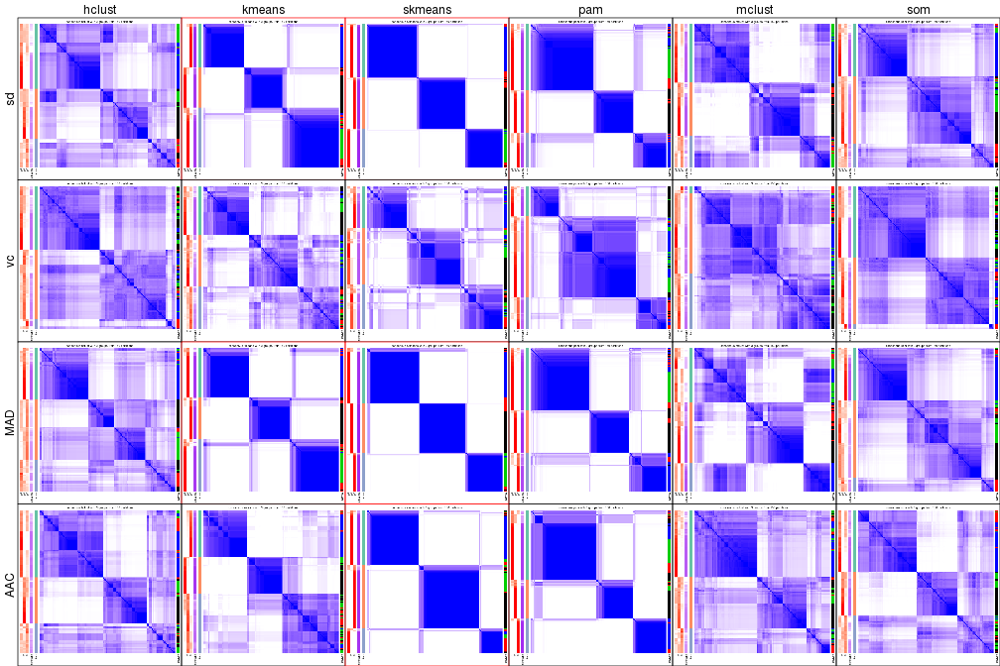
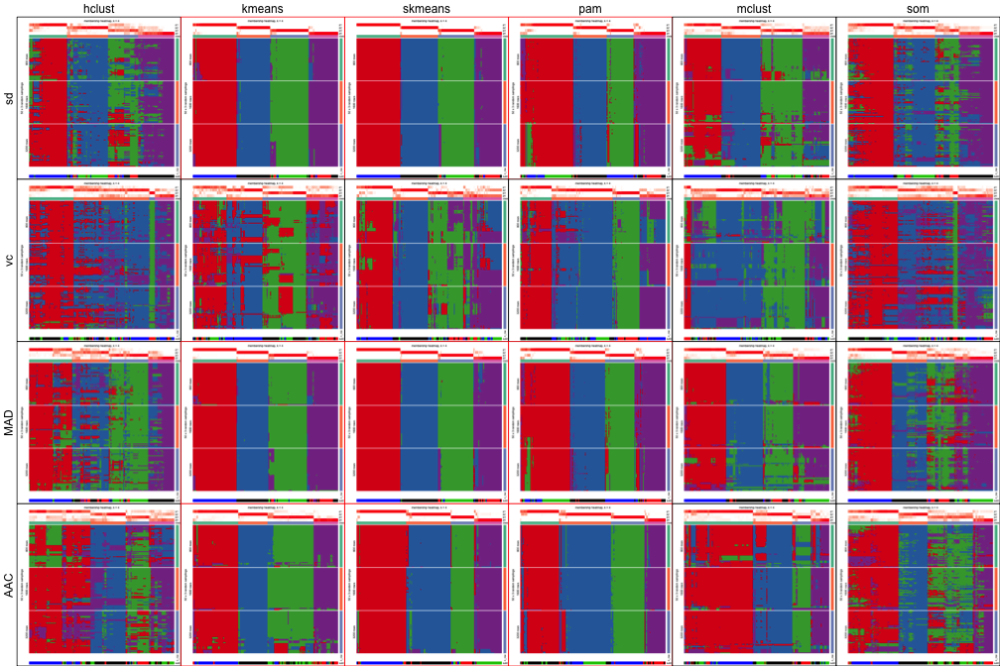
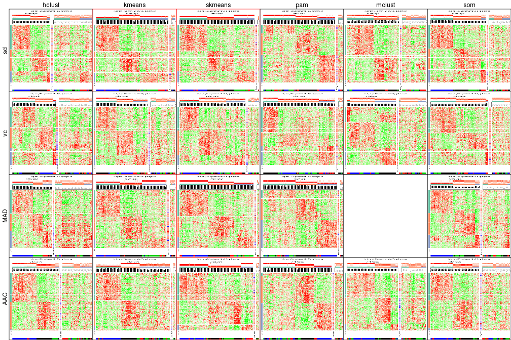
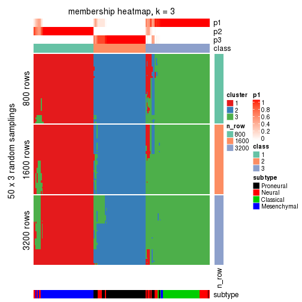
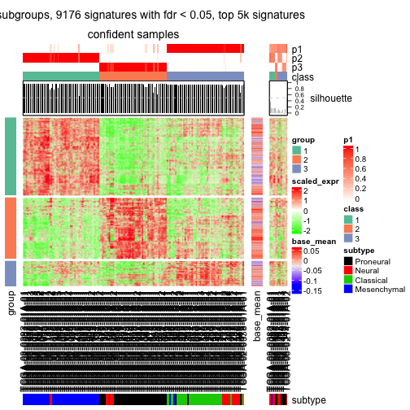
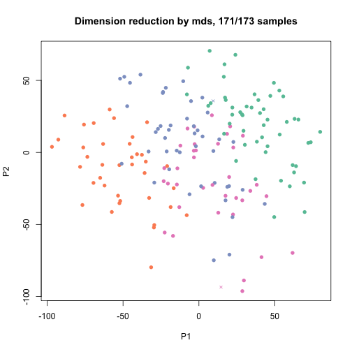
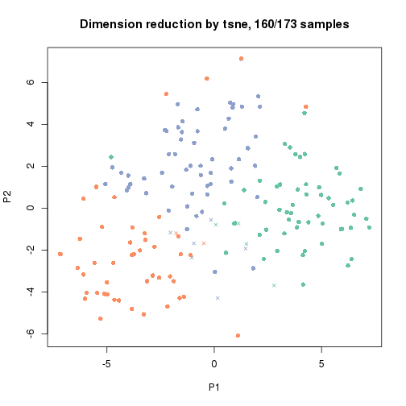

```r
library(cola)
```

Data is from https://tcga-data.nci.nih.gov/docs/publications/gbm_exp/.


```r
data = read.table("/icgc/dkfzlsdf/analysis/B080/guz/cola_test/unifiedScaled.txt", 
	header = TRUE, row.names = 1, check.names = FALSE)
data = as.matrix(data)

subtype = read.table("/icgc/dkfzlsdf/analysis/B080/guz/cola_test/TCGA_unified_CORE_ClaNC840.txt", 
	sep = "\t", header = TRUE, check.names = FALSE, stringsAsFactors = FALSE)
subtype = structure(unlist(subtype[1, -(1:2)]), names = colnames(subtype)[-(1:2)])

data = data[, names(subtype)]
dim(data)
```

```
## [1] 11861   173
```

```r
table(subtype)
```

```
## subtype
##   Classical Mesenchymal      Neural   Proneural 
##          38          56          26          53
```

Get all supported top methods and partition methods:


```r
all_top_value_methods()
```

```
## [1] "sd"  "vc"  "MAD" "AAC"
```

```r
all_partition_methods()
```

```
## [1] "hclust"  "kmeans"  "skmeans" "pam"     "mclust"  "som"
```


```r
register_top_value_fun(AAC = function(mat) AAC(t(mat), mc.cores = 4))
```

Run clustering for all combination of methods in batch:


```r
res = run_all_consensus_partition_methods(data, top_n = c(1000, 2000, 4000), k = 2:6, mc.cores = 4,
	known_anno = data.frame(subtype = subtype), 
	known_col = list(subtype = structure(seq_len(4), names = unique(subtype))))
```


```r
res_list = readRDS("/icgc/dkfzlsdf/analysis/B080/guz/cola_test/TCGA_subgroup_p0.8.rds")
res_list
```

```
## Top rows are extracted by 'sd, vc, MAD, AAC' methods.
## Subgroups are detected by 'hclust, kmeans, skmeans, pam, mclust, som' method.
## Number of partitions are tried for k = 2, 3, 4, 5, 6
## 
## Following methods can be applied to this 'ConsensusPartitionList' object:
##  [1] "collect_classes"       "collect_plots"        
##  [3] "get_best_k"            "get_class"            
##  [5] "get_single_run"        "get_stat"             
##  [7] "show"                  "test_to_known_factors"
##  [9] "top_rows_heatmap"      "top_rows_overlap"
```


```r
get_best_k(res_list)
```

```
##             best_k
## sd:hclust        5
## sd:kmeans        4
## sd:skmeans       3
## sd:pam           2
## sd:mclust        2
## sd:som           6
## vc:hclust        2
## vc:kmeans        2
## vc:skmeans       2
## vc:pam           6
## vc:mclust        2
## vc:som           2
## MAD:hclust       6
## MAD:kmeans       4
## MAD:skmeans      3
## MAD:pam          2
## MAD:mclust       2
## MAD:som          5
## AAC:hclust       2
## AAC:kmeans       4
## AAC:skmeans      2
## AAC:pam          2
## AAC:mclust       4
## AAC:som          2
```

Collect all plots for a k:


```r
collect_plots(res_list, k = 3, fun = plot_ecdf)
```


```r
collect_plots(res_list, k = 3, fun = consensus_heatmap)
```



```r
collect_plots(res_list, k = 3, fun = membership_heatmap)
```



```r
collect_plots(res_list, k = 3, fun = get_signatures)
```




```r
get_stat(res_list, k = 3)
```

```
##               cophcor        PAC mean_silhouette tot_withinss
## sd:skmeans  0.9925655 0.03076750       0.9612943     552636.9
## vc:skmeans  0.9322569 0.22111148       0.6899590     598697.2
## MAD:skmeans 0.9909607 0.03074630       0.9588787     551155.4
## AAC:skmeans 0.9858527 0.05194886       0.9236185     511120.8
## sd:mclust   0.9276846 0.21223418       0.5914851     573738.9
## vc:mclust   0.8634597 0.35848455       0.5438570     615950.6
## MAD:mclust  0.9349680 0.20948338       0.4216279     569939.6
## AAC:mclust  0.8757417 0.40507977       0.5380161     527211.0
## sd:som      0.8774034 0.34927577       0.5441187     567592.3
## vc:som      0.8415172 0.32977887       0.5829020     608274.4
## MAD:som     0.8817668 0.34983304       0.4690074     571307.7
## AAC:som     0.8961333 0.30863930       0.5197278     525227.6
## sd:kmeans   0.9780470 0.08222913       0.8944536     550039.0
## vc:kmeans   0.8888894 0.29711273       0.5485619     601346.4
## MAD:kmeans  0.9620748 0.08820030       0.8670597     549426.1
## AAC:kmeans  0.9443705 0.20387305       0.7811954     513630.6
## sd:pam      0.9720843 0.10615108       0.8709140     557629.2
## vc:pam      0.9605738 0.20456982       0.7748772     613051.5
## MAD:pam     0.9779719 0.10219099       0.8855873     556399.0
## AAC:pam     0.9706716 0.10304941       0.8625714     522115.8
## sd:hclust   0.8706158 0.40520035       0.3816293     565516.0
## vc:hclust   0.7930517 0.37455053       0.4767351     609447.7
## MAD:hclust  0.8648945 0.41862600       0.4695993     571191.0
## AAC:hclust  0.9029808 0.31239847       0.5376620     530394.4
##             area_increased
## sd:skmeans       0.3162517
## vc:skmeans       0.3184642
## MAD:skmeans      0.3133700
## AAC:skmeans      0.2566407
## sd:mclust        0.2466689
## vc:mclust        0.9546422
## MAD:mclust       0.2397274
## AAC:mclust       0.4381059
## sd:som           0.2949365
## vc:som           0.1182077
## MAD:som          0.3351408
## AAC:som          0.3259957
## sd:kmeans        0.3492004
## vc:kmeans        0.3187250
## MAD:kmeans       0.3279995
## AAC:kmeans       0.3124471
## sd:pam           0.5256164
## vc:pam           0.5108192
## MAD:pam          0.5397001
## AAC:pam          0.5703743
## sd:hclust        0.3359771
## vc:hclust        0.2801520
## MAD:hclust       0.3804079
## AAC:hclust       0.3621535
```


```r
collect_classes(res_list, k = 3)
```


Overlap of top rows in different top methods:


```r
par(mfrow = c(1, 3))
top_rows_overlap(res_list, top_n = 1000)
```

```
## Loading required namespace: venneuler
```

```r
top_rows_overlap(res_list, top_n = 2000)
top_rows_overlap(res_list, top_n = 4000)
```


Also visualize the correspondance of rankings between different scoreing methods:


```r
top_rows_overlap(res_list, top_n = 1000, type = "correspondance")
```


Heatmaps for the top rows:


```r
top_rows_heatmap(res_list, top_n = 1000)
```


Get clustering in a specified combination of top method and partition method:


```r
res = get_single_run(res_list, top_method = "MAD", partition_method = "kmeans")
res
```

```
## A 'ConsensusPartition' object with k = 2, 3, 4, 5, 6.
##   top rows (1000, 2000, 4000) are extracted by 'MAD' method.
##   subgroups are detected by 'kmeans' method.
##   best k for subgroups seems to be 4.
## 
## Following methods can be applied to this 'ConsensusPartition' object:
##  [1] "collect_classes"         "collect_plots"          
##  [3] "consensus_heatmap"       "dimension_reduction"    
##  [5] "get_best_k"              "get_class"              
##  [7] "get_consensus"           "get_membership"         
##  [9] "get_param"               "get_signatures"         
## [11] "get_stat"                "membership_heatmap"     
## [13] "plot_ecdf"               "select_partition_number"
## [15] "show"                    "signature_density"      
## [17] "test_to_known_factors"
```

Collect all plots


```r
collect_plots(res)
```


plots:


```r
select_partition_number(res)
```


```r
consensus_heatmap(res, k = 3)
```


```r
membership_heatmap(res, k = 3)
```



```r
get_signatures(res, k = 3)
```

```
## Error in getFromNamespace(device_info[3], ns = device_info[2])(temp_image): unable to open /tmp/RtmpvSFyw5/.heatmap_body_scaled_expr_1_7dec2616282.png
```



Get classifications


```r
class_df = get_class(res, k = 3)
head(class_df)
```

```
##                     class entropy silhouette
## TCGA-02-0003-01A-01     2       0  0.9462761
## TCGA-02-0010-01A-01     2       0  0.9462761
## TCGA-02-0011-01B-01     2       0  0.9462761
## TCGA-02-0014-01A-01     2       0  0.9462761
## TCGA-02-0024-01B-01     2       0  0.9462761
## TCGA-02-0026-01B-01     2       0  0.9462761
```

MDS or T-sne plots:


```r
dimension_reduction(res, k = 3)
```



```r
dimension_reduction(res, k = 3, method = "tsne")
```



Consistency of classes.


```r
collect_classes(res_list, k = 3)
```


```r
collect_classes(res)
```


```r
res = hierarchical_partition(data, top_n = c(1000, 2000, 4000), 
	known_anno = data.frame(subtype = subtype), 
	known_col = list(subtype = structure(seq_len(4), names = unique(subtype))))
```

```
## submatrix with 173 columns and 11861 rows, node_id: 0.
```

```
## Loading required namespace: genefilter
```

```
## best k = 4, most tight subgroup: 3
## partitioned into two subgroups with 46 and 127 columns.
## 
## submatrix with 46 columns and 11861 rows, node_id: 03.
## best k = 2, most tight subgroup: 1
## PAC score too big 0.201585435152523, stop.
## 
## submatrix with 127 columns and 11861 rows, node_id: 00.
## best k = 3, most tight subgroup: 1
## partitioned into two subgroups with 52 and 75 columns.
## 
## submatrix with 52 columns and 11861 rows, node_id: 001.
## best k = 2, most tight subgroup: 1
## partitioned into two subgroups with 38 and 14 columns.
## 
## submatrix with 38 columns and 11861 rows, node_id: 0011.
## best k = 3, most tight subgroup: 2
## PAC score too big 0.386461318549604, stop.
## 
## submatrix with 14 columns and 11861 rows, node_id: 0010.
## best k = 3, most tight subgroup: 1
## subgroups have too few columns, stop.
## 
## submatrix with 75 columns and 11861 rows, node_id: 000.
## best k = 2, most tight subgroup: 1
## partitioned into two subgroups with 37 and 38 columns.
## 
## submatrix with 37 columns and 11861 rows, node_id: 0001.
## best k = 2, most tight subgroup: 1
## subgroups have too few columns, stop.
## 
## submatrix with 38 columns and 11861 rows, node_id: 0000.
## best k = 3, most tight subgroup: 1
## partitioned into two subgroups with 16 and 22 columns.
## 
## submatrix with 16 columns and 11861 rows, node_id: 00001.
## Number of signatures are too small (< 100), stop.
## 
## submatrix with 22 columns and 11861 rows, node_id: 00000.
## best k = 2, most tight subgroup: 1
## partitioned into two subgroups with 9 and 13 columns.
## 
## submatrix with 9 columns and 11861 rows, node_id: 000001.
## Number of signatures are too small (< 100), stop.
## 
## submatrix with 13 columns and 11861 rows, node_id: 000000.
## Number of signatures are too small (< 100), stop.
```


```r
res = readRDS("/icgc/dkfzlsdf/analysis/B080/guz/cola_test/TCGA_subgroup_hierarchical_partition.rds")
res
```

```
## A 'HierarchicalPartition' object with 'MAD:kmeans' method.
## 
## +-- 01, 52 cols
## |   |-- 011, 37 cols
## |   +-- 010, 15 cols
## +-- 00, 121 cols
##     |-- 001, 46 cols
##     +-- 000, 75 cols
##         |-- 0001, 37 cols
##         +-- 0000, 38 cols
##             |-- 00001, 16 cols
##             +-- 00000, 22 cols
##                 |-- 000002, 7 cols
##                 +-- 000000, 15 cols
##                     |-- 0000001, 8 cols
##                     +-- 0000000, 7 cols
## 
## Following methods can be applied to this 'HierarchicalPartition' object:
## [1] "collect_classes"       "get_class"             "get_signatures"       
## [4] "get_single_run"        "show"                  "test_to_known_factors"
```


```r
collect_classes(res)
```


```r
get_class(res)
```

```
## TCGA-02-0003-01A-01 TCGA-02-0010-01A-01 TCGA-02-0011-01B-01 
##             "00001"           "0000000"           "0000001" 
## TCGA-02-0014-01A-01 TCGA-02-0024-01B-01 TCGA-02-0026-01B-01 
##           "0000000"            "000002"           "0000000" 
## TCGA-02-0028-01A-01 TCGA-02-0046-01A-01 TCGA-02-0047-01A-01 
##           "0000000"             "00001"              "0001" 
## TCGA-02-0048-01A-01 TCGA-02-0060-01A-01 TCGA-02-0069-01A-01 
##             "00001"              "0001"            "000002" 
## TCGA-02-0074-01A-01 TCGA-02-0080-01A-01 TCGA-02-0084-01A-03 
##             "00001"           "0000001"              "0001" 
## TCGA-02-0087-01A-01 TCGA-02-0104-01A-01 TCGA-02-0114-01A-01 
##              "0001"           "0000000"           "0000000" 
## TCGA-02-0281-01A-01 TCGA-02-0321-01A-01 TCGA-02-0325-01A-01 
##            "000002"               "001"           "0000001" 
## TCGA-02-0338-01A-01 TCGA-02-0339-01A-01 TCGA-02-0432-01A-02 
##            "000002"            "000002"           "0000001" 
## TCGA-02-0439-01A-01 TCGA-02-0440-01A-01 TCGA-02-0446-01A-01 
##              "0001"             "00001"              "0001" 
## TCGA-06-0128-01A-01 TCGA-06-0129-01A-01 TCGA-06-0146-01A-01 
##              "0001"           "0000000"           "0000001" 
## TCGA-06-0156-01A-01 TCGA-06-0166-01A-01 TCGA-06-0174-01A-01 
##              "0001"              "0001"             "00001" 
## TCGA-06-0177-01A-01 TCGA-06-0238-01A-02 TCGA-06-0241-01A-02 
##             "00001"              "0001"             "00001" 
## TCGA-06-0410-01A-01 TCGA-06-0413-01A-01 TCGA-06-0414-01A-01 
##             "00001"            "000002"             "00001" 
## TCGA-06-0646-01A-01 TCGA-06-0648-01A-01 TCGA-08-0245-01A-01 
##              "0001"             "00001"             "00001" 
## TCGA-08-0344-01A-01 TCGA-08-0347-01A-01 TCGA-08-0348-01A-01 
##           "0000001"              "0001"             "00001" 
## TCGA-08-0350-01A-01 TCGA-08-0353-01A-01 TCGA-08-0359-01A-01 
##           "0000001"               "001"              "0001" 
## TCGA-08-0385-01A-01 TCGA-08-0517-01A-01 TCGA-08-0524-01A-01 
##           "0000001"             "00001"            "000002" 
## TCGA-12-0616-01A-01 TCGA-12-0618-01A-01 TCGA-02-0089-01A-01 
##             "00001"             "00001"              "0001" 
## TCGA-02-0113-01A-01 TCGA-02-0115-01A-01 TCGA-02-0451-01A-01 
##               "001"              "0001"              "0001" 
## TCGA-06-0132-01A-02 TCGA-06-0133-01A-02 TCGA-06-0138-01A-02 
##              "0001"              "0001"              "0001" 
## TCGA-06-0160-01A-01 TCGA-06-0162-01A-01 TCGA-06-0167-01A-01 
##              "0001"              "0001"              "0001" 
## TCGA-06-0171-01A-02 TCGA-06-0173-01A-01 TCGA-06-0179-01A-02 
##              "0001"              "0001"              "0001" 
## TCGA-06-0182-01A-01 TCGA-06-0185-01A-01 TCGA-06-0195-01B-01 
##               "001"               "001"              "0001" 
## TCGA-06-0208-01B-01 TCGA-06-0214-01A-02 TCGA-06-0219-01A-01 
##              "0001"              "0001"              "0001" 
## TCGA-06-0221-01A-01 TCGA-06-0237-01A-02 TCGA-06-0240-01A-02 
##              "0001"              "0001"              "0001" 
## TCGA-08-0349-01A-01 TCGA-08-0380-01A-01 TCGA-08-0386-01A-01 
##              "0001"              "0001"               "001" 
## TCGA-08-0520-01A-01 TCGA-02-0007-01A-01 TCGA-02-0009-01A-01 
##              "0001"               "001"               "001" 
## TCGA-02-0016-01A-01 TCGA-02-0021-01A-01 TCGA-02-0023-01B-01 
##               "001"               "001"               "001" 
## TCGA-02-0027-01A-01 TCGA-02-0038-01A-01 TCGA-02-0043-01A-01 
##               "001"               "001"               "001" 
## TCGA-02-0070-01A-01 TCGA-02-0102-01A-01 TCGA-02-0260-01A-03 
##               "001"               "001"               "001" 
## TCGA-02-0269-01B-01 TCGA-02-0285-01A-01 TCGA-02-0289-01A-01 
##               "001"               "001"               "001" 
## TCGA-02-0290-01A-01 TCGA-02-0317-01A-01 TCGA-02-0333-01A-02 
##               "001"               "001"               "001" 
## TCGA-02-0422-01A-01 TCGA-02-0430-01A-01 TCGA-06-0125-01A-01 
##               "001"               "001"               "001" 
## TCGA-06-0126-01A-01 TCGA-06-0137-01A-03 TCGA-06-0145-01A-04 
##               "001"               "001"               "001" 
## TCGA-06-0148-01A-01 TCGA-06-0187-01A-01 TCGA-06-0211-01B-01 
##               "001"               "001"               "001" 
## TCGA-06-0402-01A-01 TCGA-08-0246-01A-01 TCGA-08-0354-01A-01 
##               "001"               "001"               "001" 
## TCGA-08-0355-01A-01 TCGA-08-0357-01A-01 TCGA-08-0358-01A-01 
##               "001"               "001"               "001" 
## TCGA-08-0375-01A-01 TCGA-08-0511-01A-01 TCGA-08-0514-01A-01 
##               "001"               "001"               "001" 
## TCGA-08-0518-01A-01 TCGA-08-0529-01A-02 TCGA-08-0531-01A-01 
##               "001"               "001"               "001" 
## TCGA-02-0057-01A-01 TCGA-02-0004-01A-01 TCGA-02-0006-01B-01 
##              "0001"               "010"               "011" 
## TCGA-02-0025-01A-01 TCGA-02-0033-01A-01 TCGA-02-0034-01A-01 
##               "010"               "010"               "010" 
## TCGA-02-0039-01A-01 TCGA-02-0051-01A-01 TCGA-02-0054-01A-01 
##               "011"               "010"               "011" 
## TCGA-02-0055-01A-01 TCGA-02-0059-01A-01 TCGA-02-0064-01A-01 
##               "010"               "010"               "011" 
## TCGA-02-0075-01A-01 TCGA-02-0079-01A-03 TCGA-02-0085-01A-01 
##               "011"               "011"              "0001" 
## TCGA-02-0086-01A-01 TCGA-02-0099-01A-01 TCGA-02-0106-01A-01 
##               "011"               "011"               "010" 
## TCGA-02-0107-01A-01 TCGA-02-0111-01A-01 TCGA-02-0326-01A-01 
##               "011"               "011"               "001" 
## TCGA-02-0337-01A-01 TCGA-06-0122-01A-01 TCGA-06-0124-01A-01 
##               "011"               "011"               "011" 
## TCGA-06-0130-01A-01 TCGA-06-0139-01A-01 TCGA-06-0143-01A-01 
##               "010"               "010"               "011" 
## TCGA-06-0147-01A-01 TCGA-06-0149-01A-05 TCGA-06-0152-01A-02 
##               "011"               "011"               "001" 
## TCGA-06-0154-01A-02 TCGA-06-0164-01A-01 TCGA-06-0175-01A-01 
##               "011"               "011"               "011" 
## TCGA-06-0176-01A-03 TCGA-06-0184-01A-01 TCGA-06-0189-01A-05 
##               "010"               "011"               "010" 
## TCGA-06-0190-01A-01 TCGA-06-0194-01A-01 TCGA-06-0197-01A-02 
##               "011"               "011"               "011" 
## TCGA-06-0210-01A-01 TCGA-06-0397-01A-01 TCGA-06-0409-01A-02 
##               "011"               "011"               "011" 
## TCGA-06-0412-01A-01 TCGA-06-0644-01A-02 TCGA-06-0645-01A-01 
##               "011"               "010"               "011" 
## TCGA-08-0346-01A-01 TCGA-08-0352-01A-01 TCGA-08-0360-01A-01 
##               "011"               "011"               "011" 
## TCGA-08-0390-01A-01 TCGA-08-0392-01A-01 TCGA-08-0509-01A-01 
##               "011"               "010"               "011" 
## TCGA-08-0510-01A-01 TCGA-08-0512-01A-01 TCGA-08-0522-01A-01 
##               "011"               "011"               "010" 
## TCGA-12-0619-01A-01 TCGA-12-0620-01A-01 
##               "011"               "011"
```

