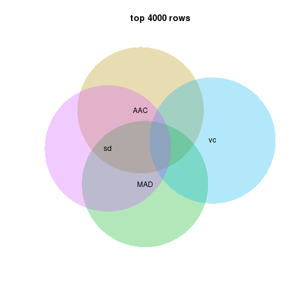
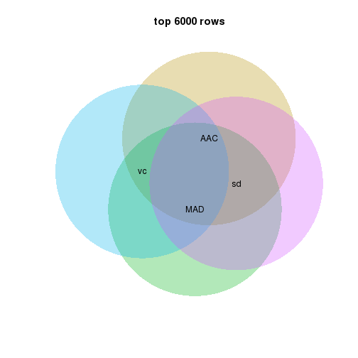
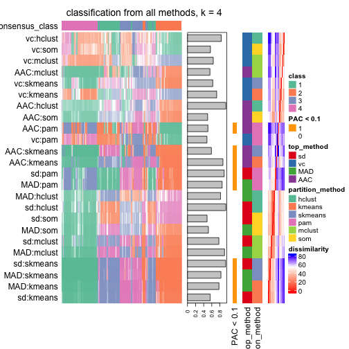
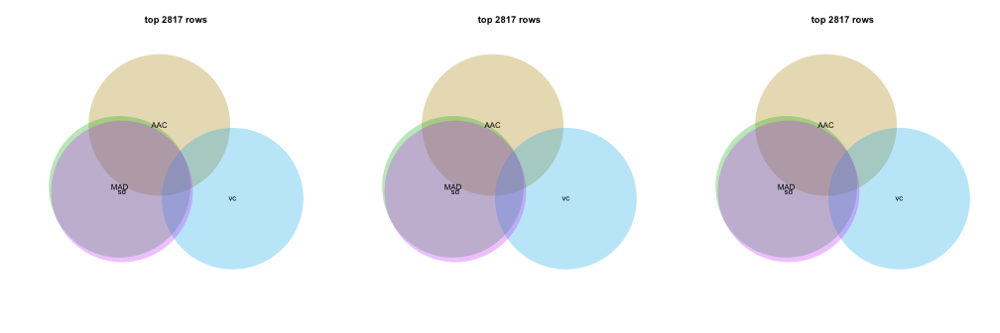
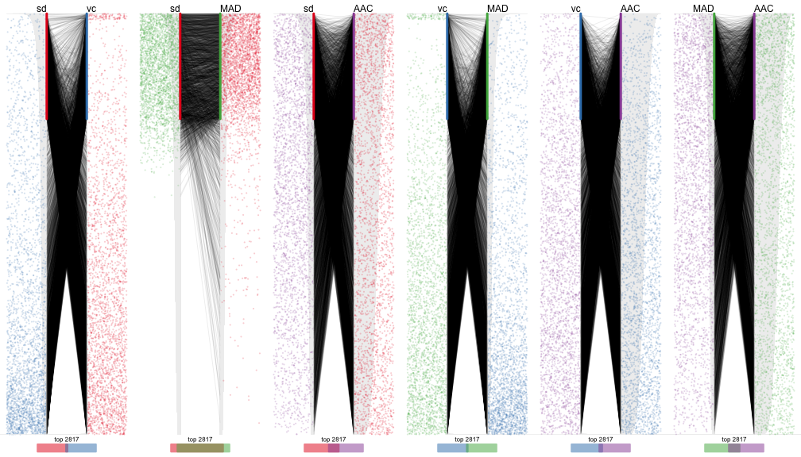
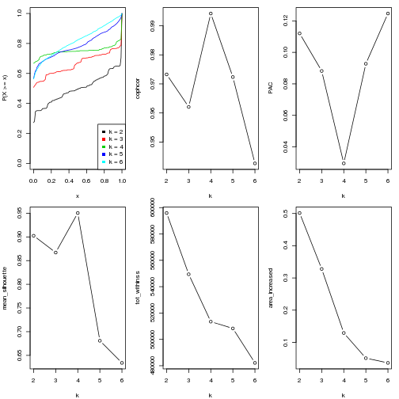
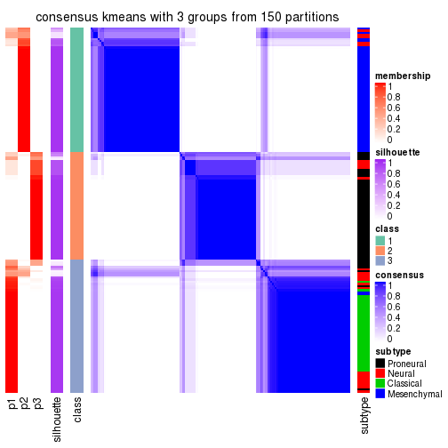
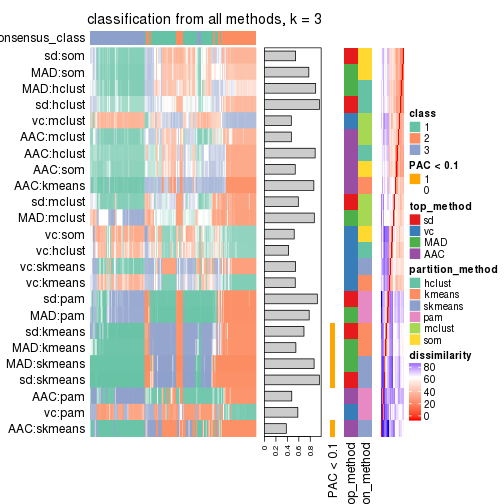
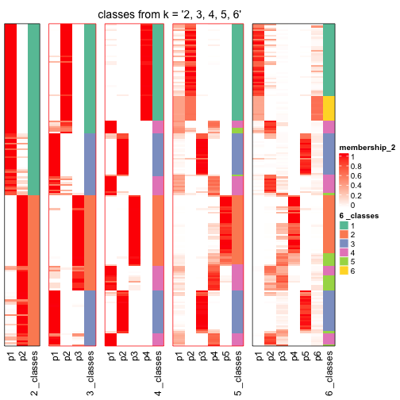

```r
library(cola)
```

Data is from https://tcga-data.nci.nih.gov/docs/publications/gbm_exp/.


```r
data = read.table("~/analysis/unifiedScaled.txt", header = TRUE, row.names = 1, 
	check.names = FALSE)
data = as.matrix(data)

subtype = read.table("~/analysis/TCGA_unified_CORE_ClaNC840.txt", 
	sep = "\t", header = TRUE, check.names = FALSE, stringsAsFactors = FALSE)
subtype = structure(unlist(subtype[1, -(1:2)]), names = colnames(subtype)[-(1:2)])

data = data[, names(subtype)]
dim(data)
```

```
## [1] 11861   173
```

```r
table(subtype)
```

```
## subtype
##   Classical Mesenchymal      Neural   Proneural 
##          38          56          26          53
```

Get all supported top methods and partition methods:


```r
all_top_value_methods()
```

```
## [1] "sd"  "vc"  "MAD" "AAC"
```

```r
all_partition_methods()
```

```
## [1] "hclust"  "kmeans"  "skmeans" "pam"     "mclust"  "som"
```


```r
register_top_value_fun(AAC = function(mat) AAC(t(mat), mc.cores = 4))
```

Run clustering for all combination of methods in batch:


```r
## res_list = run_all_consensus_partition_methods(data, top_n = c(1000, 2000, 4000), k = 2:6, mc.cores = 4,
## 	known_anno = data.frame(subtype = subtype), 
## 	known_col = list(subtype = structure(seq_len(4), names = unique(subtype))))
## res_list
```


```r
get_best_k(res_list)
```

```
##             best_k   cophcor        PAC mean_silhouette
## sd:hclust        6 0.9094122 0.24330903       0.4994752
## sd:kmeans        4 0.9867934 0.04820241       0.9137934
## sd:skmeans       3 0.9922243 0.03066354       0.9613865
## sd:pam           2 0.9934359 0.03615153       0.9684454
## sd:mclust        2 0.9771780 0.08593616       0.9226205
## sd:som           5 0.9173885 0.22281407       0.6050151
## vc:hclust        6 0.8645741 0.35070442       0.4826868
## vc:kmeans        2 0.9484612 0.16464367       0.8451851
## vc:skmeans       2 0.9729157 0.08327325       0.9188394
## vc:pam           6 0.9608122 0.10457764       0.7834789
## vc:mclust        2 0.9400835 0.12350497       0.8016653
## vc:som           2 0.8078426 0.30816388       0.6152749
## MAD:hclust       6 0.9158306 0.22948724       0.5299491
## MAD:kmeans       4 0.9938793 0.03058575       0.9494560
## MAD:skmeans      3 0.9897329 0.03178744       0.9545245
## MAD:pam          2 0.9913577 0.04219626       0.9619030
## MAD:mclust       2 0.9671705 0.09492363       0.9030578
## MAD:som          6 0.9328326 0.18225361       0.6132457
## AAC:hclust       2 0.8865921 0.26475628       0.7315061
## AAC:kmeans       2 0.9879978 0.06637911       0.9500758
## AAC:skmeans      2 0.9929374 0.02974800       0.9736079
## AAC:pam          2 0.9782622 0.09175420       0.9051787
## AAC:mclust       4 0.9523783 0.21830801       0.7279697
## AAC:som          2 0.9197901 0.25076993       0.7506715
```

Collect all plots for a k:


```r
collect_plots(res_list, k = 4, fun = plot_ecdf)
```


```r
collect_plots(res_list, k = 4, fun = consensus_heatmap)
```



```r
collect_plots(res_list, k = 4, fun = membership_heatmap)
```



```r
# collect_plots(res_list, k = 3, fun = get_signatures)
```


```r
get_stat(res_list, k = 4)
```

```
##               cophcor        PAC mean_silhouette tot_withinss
## sd:skmeans  0.9904512 0.02939927       0.9453256     515908.2
## vc:skmeans  0.9055941 0.21837564       0.6286833     571295.4
## MAD:skmeans 0.9921474 0.03839881       0.9438570     515334.7
## AAC:skmeans 0.9839792 0.05661884       0.8978034     480727.7
## sd:mclust   0.9485036 0.23587514       0.7270282     530099.1
## vc:mclust   0.8710222 0.35022307       0.4938555     578485.6
## MAD:mclust  0.9725038 0.15274525       0.8238450     524515.2
## AAC:mclust  0.9523783 0.21830801       0.7279697     488370.6
## sd:som      0.9113848 0.28755205       0.6595718     518174.7
## vc:som      0.8456411 0.38379417       0.4628444     582100.4
## MAD:som     0.9055094 0.29045254       0.6311532     516131.8
## AAC:som     0.8560991 0.30889917       0.5111046     479176.9
## sd:kmeans   0.9867934 0.04820241       0.9137934     514412.8
## vc:kmeans   0.8745586 0.28340348       0.5185240     574381.6
## MAD:kmeans  0.9938793 0.03058575       0.9494560     513463.6
## AAC:kmeans  0.9860569 0.07229192       0.8856360     472855.8
## sd:pam      0.9585691 0.10005773       0.8200042     530782.7
## vc:pam      0.9526215 0.17625776       0.7600683     582850.5
## MAD:pam     0.9636888 0.09483821       0.8203004     527160.4
## AAC:pam     0.9670917 0.08431730       0.8572551     484527.6
## sd:hclust   0.8965037 0.31667222       0.5929598     520805.0
## vc:hclust   0.8566581 0.37164395       0.5434642     588382.0
## MAD:hclust  0.8908500 0.29405492       0.5777541     522589.3
## AAC:hclust  0.8453134 0.32709684       0.4808156     484521.1
##             area_increased
## sd:skmeans       0.1228735
## vc:skmeans       0.1219967
## MAD:skmeans      0.1235529
## AAC:skmeans      0.1459457
## sd:mclust        0.1561688
## vc:mclust        0.3440433
## MAD:mclust       0.1902568
## AAC:mclust       0.1597279
## sd:som           0.2104291
## vc:som           0.2345725
## MAD:som          0.1663282
## AAC:som          0.1398289
## sd:kmeans        0.1342628
## vc:kmeans        0.1177357
## MAD:kmeans       0.1289669
## AAC:kmeans       0.1284463
## sd:pam           0.1501228
## vc:pam           0.1782579
## MAD:pam          0.1423781
## AAC:pam          0.1363856
## sd:hclust        0.1970805
## vc:hclust        0.2091184
## MAD:hclust       0.1726574
## AAC:hclust       0.1498017
```


```r
collect_classes(res_list, k = 4)
```


Overlap of top rows in different top methods:


```r
par(mfrow = c(1, 3))
top_rows_overlap(res_list, top_n = 1000)
```

```
## Loading required namespace: venneuler
```

```r
top_rows_overlap(res_list, top_n = 2000)
top_rows_overlap(res_list, top_n = 4000)
```



Also visualize the correspondance of rankings between different scoreing methods:


```r
top_rows_overlap(res_list, top_n = 1000, type = "correspondance")
```



Heatmaps for the top rows:


```r
top_rows_heatmap(res_list, top_n = 1000)
```



Get clustering in a specified combination of top method and partition method:


```r
res = get_single_run(res_list, top_method = "MAD", partition_method = "kmeans")
res
```

```
## A 'ConsensusPartition' object with k = 2, 3, 4, 5, 6.
##   top rows (1000, 2000, 4000) are extracted by 'MAD' method.
##   subgroups are detected by 'kmeans' method.
##   best k for subgroups seems to be 4.
## 
## Following methods can be applied to this 'ConsensusPartition' object:
##  [1] "collect_classes"         "collect_plots"          
##  [3] "consensus_heatmap"       "dimension_reduction"    
##  [5] "get_best_k"              "get_class"              
##  [7] "get_consensus"           "get_membership"         
##  [9] "get_param"               "get_signatures"         
## [11] "get_stat"                "membership_heatmap"     
## [13] "plot_ecdf"               "select_partition_number"
## [15] "show"                    "signature_density"      
## [17] "test_to_known_factors"
```

Collect all plots


```r
collect_plots(res)
```

```
## Loading required namespace: genefilter
```


plots:


```r
select_partition_number(res)
```


```r
get_best_k(res)
```

```
## [1] 4
```

```r
consensus_heatmap(res, k = 4)
```



```r
membership_heatmap(res, k = 4)
```



```r
# get_signatures(res, k = 4)
```

Get classifications


```r
get_class(res, k = 4)
```

```
##                     class    entropy silhouette
## TCGA-02-0003-01A-01     4 0.31715478  0.8054178
## TCGA-02-0010-01A-01     4 0.00000000  0.9881313
## TCGA-02-0011-01B-01     4 0.00000000  0.9881313
## TCGA-02-0014-01A-01     4 0.00000000  0.9881313
## TCGA-02-0024-01B-01     4 0.00000000  0.9881313
## TCGA-02-0026-01B-01     4 0.00000000  0.9881313
## TCGA-02-0028-01A-01     4 0.00000000  0.9881313
## TCGA-02-0046-01A-01     4 0.00000000  0.9881313
## TCGA-02-0047-01A-01     3 0.00000000  0.9674142
## TCGA-02-0048-01A-01     4 0.05107902  0.9753276
## TCGA-02-0060-01A-01     3 0.17667967  0.9214547
## TCGA-02-0069-01A-01     4 0.00000000  0.9881313
## TCGA-02-0074-01A-01     4 0.00000000  0.9881313
## TCGA-02-0080-01A-01     4 0.00000000  0.9881313
## TCGA-02-0084-01A-03     3 0.13603239  0.9296546
## TCGA-02-0087-01A-01     3 0.24488951  0.8818411
## TCGA-02-0104-01A-01     4 0.00000000  0.9881313
## TCGA-02-0114-01A-01     4 0.00000000  0.9881313
## TCGA-02-0281-01A-01     4 0.00000000  0.9881313
## TCGA-02-0321-01A-01     2 0.34722304  0.7797318
## TCGA-02-0325-01A-01     4 0.07072027  0.9689796
## TCGA-02-0338-01A-01     4 0.00000000  0.9881313
## TCGA-02-0339-01A-01     4 0.00000000  0.9881313
## TCGA-02-0432-01A-02     4 0.00000000  0.9881313
## TCGA-02-0439-01A-01     3 0.00000000  0.9674142
## TCGA-02-0440-01A-01     4 0.00000000  0.9881313
## TCGA-02-0446-01A-01     3 0.00000000  0.9674142
## TCGA-06-0128-01A-01     3 0.26468043  0.8672178
## TCGA-06-0129-01A-01     4 0.00000000  0.9881313
## TCGA-06-0146-01A-01     4 0.00000000  0.9881313
## TCGA-06-0156-01A-01     3 0.00000000  0.9674142
## TCGA-06-0166-01A-01     3 0.00000000  0.9674142
## TCGA-06-0174-01A-01     4 0.00000000  0.9881313
## TCGA-06-0177-01A-01     4 0.00000000  0.9881313
## TCGA-06-0238-01A-02     3 0.47659859  0.4194361
## TCGA-06-0241-01A-02     4 0.00000000  0.9881313
## TCGA-06-0410-01A-01     4 0.00000000  0.9881313
## TCGA-06-0413-01A-01     4 0.00000000  0.9881313
## TCGA-06-0414-01A-01     4 0.00000000  0.9881313
## TCGA-06-0646-01A-01     3 0.00000000  0.9674142
## TCGA-06-0648-01A-01     4 0.00000000  0.9881313
## TCGA-08-0245-01A-01     4 0.00000000  0.9881313
## TCGA-08-0344-01A-01     4 0.00000000  0.9881313
## TCGA-08-0347-01A-01     3 0.00000000  0.9674142
## TCGA-08-0348-01A-01     4 0.38607757  0.7005131
## TCGA-08-0350-01A-01     4 0.00000000  0.9881313
## TCGA-08-0353-01A-01     2 0.00000000  0.9574407
## TCGA-08-0359-01A-01     3 0.00000000  0.9674142
## TCGA-08-0385-01A-01     4 0.00000000  0.9881313
## TCGA-08-0517-01A-01     4 0.00000000  0.9881313
## TCGA-08-0524-01A-01     4 0.00000000  0.9881313
## TCGA-12-0616-01A-01     4 0.00000000  0.9881313
## TCGA-12-0618-01A-01     4 0.00000000  0.9881313
## TCGA-02-0089-01A-01     3 0.00000000  0.9674142
## TCGA-02-0113-01A-01     2 0.39752014  0.7128318
## TCGA-02-0115-01A-01     3 0.00000000  0.9674142
## TCGA-02-0451-01A-01     3 0.00000000  0.9674142
## TCGA-06-0132-01A-02     3 0.00000000  0.9674142
## TCGA-06-0133-01A-02     3 0.00000000  0.9674142
## TCGA-06-0138-01A-02     3 0.00000000  0.9674142
## TCGA-06-0160-01A-01     3 0.17667967  0.9214547
## TCGA-06-0162-01A-01     3 0.00000000  0.9674142
## TCGA-06-0167-01A-01     3 0.17667967  0.9214547
## TCGA-06-0171-01A-02     3 0.00000000  0.9674142
## TCGA-06-0173-01A-01     3 0.00000000  0.9674142
## TCGA-06-0179-01A-02     3 0.00000000  0.9674142
## TCGA-06-0182-01A-01     2 0.40297602  0.7033349
## TCGA-06-0185-01A-01     2 0.40297602  0.7033349
## TCGA-06-0195-01B-01     3 0.07072027  0.9549474
## TCGA-06-0208-01B-01     3 0.00000000  0.9674142
## TCGA-06-0214-01A-02     3 0.00000000  0.9674142
## TCGA-06-0219-01A-01     3 0.00000000  0.9674142
## TCGA-06-0221-01A-01     3 0.17667967  0.9214547
## TCGA-06-0237-01A-02     3 0.00000000  0.9674142
## TCGA-06-0240-01A-02     3 0.00000000  0.9674142
## TCGA-08-0349-01A-01     3 0.00000000  0.9674142
## TCGA-08-0380-01A-01     3 0.00000000  0.9674142
## TCGA-08-0386-01A-01     2 0.41337319  0.6829004
## TCGA-08-0520-01A-01     3 0.34722304  0.7457438
## TCGA-02-0007-01A-01     2 0.37390308  0.7481370
## TCGA-02-0009-01A-01     2 0.00000000  0.9574407
## TCGA-02-0016-01A-01     2 0.00000000  0.9574407
## TCGA-02-0021-01A-01     2 0.00000000  0.9574407
## TCGA-02-0023-01B-01     2 0.00000000  0.9574407
## TCGA-02-0027-01A-01     2 0.05107902  0.9468363
## TCGA-02-0038-01A-01     2 0.49588852  0.2733482
## TCGA-02-0043-01A-01     2 0.00000000  0.9574407
## TCGA-02-0070-01A-01     2 0.00000000  0.9574407
## TCGA-02-0102-01A-01     2 0.00000000  0.9574407
## TCGA-02-0260-01A-03     2 0.00000000  0.9574407
## TCGA-02-0269-01B-01     2 0.00000000  0.9574407
## TCGA-02-0285-01A-01     2 0.00000000  0.9574407
## TCGA-02-0289-01A-01     2 0.00000000  0.9574407
## TCGA-02-0290-01A-01     2 0.00000000  0.9574407
## TCGA-02-0317-01A-01     2 0.00000000  0.9574407
## TCGA-02-0333-01A-02     2 0.00000000  0.9574407
## TCGA-02-0422-01A-01     2 0.00000000  0.9574407
## TCGA-02-0430-01A-01     2 0.00000000  0.9574407
## TCGA-06-0125-01A-01     2 0.00000000  0.9574407
## TCGA-06-0126-01A-01     2 0.00000000  0.9574407
## TCGA-06-0137-01A-03     2 0.00000000  0.9574407
## TCGA-06-0145-01A-04     2 0.00000000  0.9574407
## TCGA-06-0148-01A-01     2 0.00000000  0.9574407
## TCGA-06-0187-01A-01     2 0.00000000  0.9574407
## TCGA-06-0211-01B-01     2 0.00000000  0.9574407
## TCGA-06-0402-01A-01     2 0.00000000  0.9574407
## TCGA-08-0246-01A-01     2 0.00000000  0.9574407
## TCGA-08-0354-01A-01     2 0.00000000  0.9574407
## TCGA-08-0355-01A-01     2 0.00000000  0.9574407
## TCGA-08-0357-01A-01     2 0.00000000  0.9574407
## TCGA-08-0358-01A-01     2 0.00000000  0.9574407
## TCGA-08-0375-01A-01     2 0.00000000  0.9574407
## TCGA-08-0511-01A-01     2 0.00000000  0.9574407
## TCGA-08-0514-01A-01     2 0.00000000  0.9574407
## TCGA-08-0518-01A-01     2 0.00000000  0.9574407
## TCGA-08-0529-01A-02     2 0.00000000  0.9574407
## TCGA-08-0531-01A-01     2 0.00000000  0.9574407
## TCGA-02-0057-01A-01     3 0.00000000  0.9674142
## TCGA-02-0004-01A-01     1 0.00000000  0.9861507
## TCGA-02-0006-01B-01     1 0.30905974  0.8390453
## TCGA-02-0025-01A-01     1 0.00000000  0.9861507
## TCGA-02-0033-01A-01     1 0.00000000  0.9861507
## TCGA-02-0034-01A-01     1 0.00000000  0.9861507
## TCGA-02-0039-01A-01     1 0.05107902  0.9784610
## TCGA-02-0051-01A-01     1 0.00000000  0.9861507
## TCGA-02-0054-01A-01     1 0.28325475  0.8619413
## TCGA-02-0055-01A-01     1 0.00000000  0.9861507
## TCGA-02-0059-01A-01     1 0.00000000  0.9861507
## TCGA-02-0064-01A-01     1 0.00000000  0.9861507
## TCGA-02-0075-01A-01     1 0.00000000  0.9861507
## TCGA-02-0079-01A-03     1 0.05107902  0.9784610
## TCGA-02-0085-01A-01     3 0.00000000  0.9674142
## TCGA-02-0086-01A-01     1 0.00000000  0.9861507
## TCGA-02-0099-01A-01     1 0.26468043  0.8762027
## TCGA-02-0106-01A-01     1 0.00000000  0.9861507
## TCGA-02-0107-01A-01     1 0.00000000  0.9861507
## TCGA-02-0111-01A-01     1 0.00000000  0.9861507
## TCGA-02-0326-01A-01     2 0.00000000  0.9574407
## TCGA-02-0337-01A-01     1 0.17667967  0.9365656
## TCGA-06-0122-01A-01     1 0.00000000  0.9861507
## TCGA-06-0124-01A-01     1 0.00000000  0.9861507
## TCGA-06-0130-01A-01     1 0.00000000  0.9861507
## TCGA-06-0139-01A-01     1 0.00000000  0.9861507
## TCGA-06-0143-01A-01     1 0.02888898  0.9825208
## TCGA-06-0147-01A-01     1 0.00000000  0.9861507
## TCGA-06-0149-01A-05     1 0.08869473  0.9690879
## TCGA-06-0152-01A-02     2 0.00000000  0.9574407
## TCGA-06-0154-01A-02     1 0.00000000  0.9861507
## TCGA-06-0164-01A-01     1 0.00000000  0.9861507
## TCGA-06-0175-01A-01     1 0.17667967  0.9365656
## TCGA-06-0176-01A-03     1 0.00000000  0.9861507
## TCGA-06-0184-01A-01     1 0.17667967  0.9365656
## TCGA-06-0189-01A-05     1 0.00000000  0.9861507
## TCGA-06-0190-01A-01     1 0.00000000  0.9861507
## TCGA-06-0194-01A-01     1 0.00000000  0.9861507
## TCGA-06-0197-01A-02     1 0.00000000  0.9861507
## TCGA-06-0210-01A-01     1 0.00000000  0.9861507
## TCGA-06-0397-01A-01     1 0.00000000  0.9861507
## TCGA-06-0409-01A-02     1 0.00000000  0.9861507
## TCGA-06-0412-01A-01     1 0.00000000  0.9861507
## TCGA-06-0644-01A-02     1 0.00000000  0.9861507
## TCGA-06-0645-01A-01     1 0.00000000  0.9861507
## TCGA-08-0346-01A-01     1 0.00000000  0.9861507
## TCGA-08-0352-01A-01     1 0.02888898  0.9825208
## TCGA-08-0360-01A-01     1 0.00000000  0.9861507
## TCGA-08-0390-01A-01     1 0.07072027  0.9739459
## TCGA-08-0392-01A-01     1 0.00000000  0.9861507
## TCGA-08-0509-01A-01     1 0.00000000  0.9861507
## TCGA-08-0510-01A-01     1 0.00000000  0.9861507
## TCGA-08-0512-01A-01     1 0.00000000  0.9861507
## TCGA-08-0522-01A-01     1 0.00000000  0.9861507
## TCGA-12-0619-01A-01     1 0.00000000  0.9861507
## TCGA-12-0620-01A-01     1 0.10542115  0.9593842
```

MDS or T-sne plots:


```r
dimension_reduction(res, k = 4)
```

```
## Error in cmdscale(dist(t(data))): 'k' must be in {1, 2, ..  n - 1}
```

```r
dimension_reduction(res, k = 4, method = "tsne")
```

```
## Error in Rtsne.default(X = structure(numeric(0), .Dim = c(0L, 11268L), .Dimnames = list(: Perplexity is too large.
```

Consistency of classes.


```r
collect_classes(res_list, k = 4)
```



```r
collect_classes(res)
```


```r
res = hierarchical_partition(data, top_n = c(1000, 2000, 4000), 
	known_anno = data.frame(subtype = subtype), 
	known_col = list(subtype = structure(seq_len(4), names = unique(subtype))))
```


```r
res = readRDS("~/analysis/TCGA_subgroup_hierarchical_partition.rds")
res
```

```
## A 'HierarchicalPartition' object with 'MAD:kmeans' method.
## 
## +-- 01, 52 cols
## |   |-- 011, 37 cols
## |   +-- 010, 15 cols
## +-- 00, 121 cols
##     |-- 001, 46 cols
##     +-- 000, 75 cols
##         |-- 0001, 37 cols
##         +-- 0000, 38 cols
##             |-- 00001, 16 cols
##             +-- 00000, 22 cols
##                 |-- 000001, 9 cols
##                 +-- 000000, 13 cols
## 
## Following methods can be applied to this 'HierarchicalPartition' object:
## [1] "collect_classes"       "get_class"             "get_signatures"       
## [4] "get_single_run"        "show"                  "test_to_known_factors"
```


```r
collect_classes(res)
```




```r
get_class(res)
```

```
## TCGA-02-0003-01A-01 TCGA-02-0010-01A-01 TCGA-02-0011-01B-01 
##             "00001"            "000000"            "000001" 
## TCGA-02-0014-01A-01 TCGA-02-0024-01B-01 TCGA-02-0026-01B-01 
##            "000000"            "000000"            "000001" 
## TCGA-02-0028-01A-01 TCGA-02-0046-01A-01 TCGA-02-0047-01A-01 
##            "000000"             "00001"              "0001" 
## TCGA-02-0048-01A-01 TCGA-02-0060-01A-01 TCGA-02-0069-01A-01 
##             "00001"              "0001"            "000000" 
## TCGA-02-0074-01A-01 TCGA-02-0080-01A-01 TCGA-02-0084-01A-03 
##             "00001"            "000001"              "0001" 
## TCGA-02-0087-01A-01 TCGA-02-0104-01A-01 TCGA-02-0114-01A-01 
##              "0001"            "000000"            "000000" 
## TCGA-02-0281-01A-01 TCGA-02-0321-01A-01 TCGA-02-0325-01A-01 
##            "000000"               "001"            "000001" 
## TCGA-02-0338-01A-01 TCGA-02-0339-01A-01 TCGA-02-0432-01A-02 
##            "000000"            "000000"            "000001" 
## TCGA-02-0439-01A-01 TCGA-02-0440-01A-01 TCGA-02-0446-01A-01 
##              "0001"             "00001"              "0001" 
## TCGA-06-0128-01A-01 TCGA-06-0129-01A-01 TCGA-06-0146-01A-01 
##              "0001"            "000001"            "000001" 
## TCGA-06-0156-01A-01 TCGA-06-0166-01A-01 TCGA-06-0174-01A-01 
##              "0001"              "0001"             "00001" 
## TCGA-06-0177-01A-01 TCGA-06-0238-01A-02 TCGA-06-0241-01A-02 
##             "00001"              "0001"             "00001" 
## TCGA-06-0410-01A-01 TCGA-06-0413-01A-01 TCGA-06-0414-01A-01 
##             "00001"            "000000"             "00001" 
## TCGA-06-0646-01A-01 TCGA-06-0648-01A-01 TCGA-08-0245-01A-01 
##              "0001"             "00001"             "00001" 
## TCGA-08-0344-01A-01 TCGA-08-0347-01A-01 TCGA-08-0348-01A-01 
##            "000000"              "0001"             "00001" 
## TCGA-08-0350-01A-01 TCGA-08-0353-01A-01 TCGA-08-0359-01A-01 
##            "000001"               "001"              "0001" 
## TCGA-08-0385-01A-01 TCGA-08-0517-01A-01 TCGA-08-0524-01A-01 
##            "000001"             "00001"            "000000" 
## TCGA-12-0616-01A-01 TCGA-12-0618-01A-01 TCGA-02-0089-01A-01 
##             "00001"             "00001"              "0001" 
## TCGA-02-0113-01A-01 TCGA-02-0115-01A-01 TCGA-02-0451-01A-01 
##               "001"              "0001"              "0001" 
## TCGA-06-0132-01A-02 TCGA-06-0133-01A-02 TCGA-06-0138-01A-02 
##              "0001"              "0001"              "0001" 
## TCGA-06-0160-01A-01 TCGA-06-0162-01A-01 TCGA-06-0167-01A-01 
##              "0001"              "0001"              "0001" 
## TCGA-06-0171-01A-02 TCGA-06-0173-01A-01 TCGA-06-0179-01A-02 
##              "0001"              "0001"              "0001" 
## TCGA-06-0182-01A-01 TCGA-06-0185-01A-01 TCGA-06-0195-01B-01 
##               "001"               "001"              "0001" 
## TCGA-06-0208-01B-01 TCGA-06-0214-01A-02 TCGA-06-0219-01A-01 
##              "0001"              "0001"              "0001" 
## TCGA-06-0221-01A-01 TCGA-06-0237-01A-02 TCGA-06-0240-01A-02 
##              "0001"              "0001"              "0001" 
## TCGA-08-0349-01A-01 TCGA-08-0380-01A-01 TCGA-08-0386-01A-01 
##              "0001"              "0001"               "001" 
## TCGA-08-0520-01A-01 TCGA-02-0007-01A-01 TCGA-02-0009-01A-01 
##              "0001"               "001"               "001" 
## TCGA-02-0016-01A-01 TCGA-02-0021-01A-01 TCGA-02-0023-01B-01 
##               "001"               "001"               "001" 
## TCGA-02-0027-01A-01 TCGA-02-0038-01A-01 TCGA-02-0043-01A-01 
##               "001"               "001"               "001" 
## TCGA-02-0070-01A-01 TCGA-02-0102-01A-01 TCGA-02-0260-01A-03 
##               "001"               "001"               "001" 
## TCGA-02-0269-01B-01 TCGA-02-0285-01A-01 TCGA-02-0289-01A-01 
##               "001"               "001"               "001" 
## TCGA-02-0290-01A-01 TCGA-02-0317-01A-01 TCGA-02-0333-01A-02 
##               "001"               "001"               "001" 
## TCGA-02-0422-01A-01 TCGA-02-0430-01A-01 TCGA-06-0125-01A-01 
##               "001"               "001"               "001" 
## TCGA-06-0126-01A-01 TCGA-06-0137-01A-03 TCGA-06-0145-01A-04 
##               "001"               "001"               "001" 
## TCGA-06-0148-01A-01 TCGA-06-0187-01A-01 TCGA-06-0211-01B-01 
##               "001"               "001"               "001" 
## TCGA-06-0402-01A-01 TCGA-08-0246-01A-01 TCGA-08-0354-01A-01 
##               "001"               "001"               "001" 
## TCGA-08-0355-01A-01 TCGA-08-0357-01A-01 TCGA-08-0358-01A-01 
##               "001"               "001"               "001" 
## TCGA-08-0375-01A-01 TCGA-08-0511-01A-01 TCGA-08-0514-01A-01 
##               "001"               "001"               "001" 
## TCGA-08-0518-01A-01 TCGA-08-0529-01A-02 TCGA-08-0531-01A-01 
##               "001"               "001"               "001" 
## TCGA-02-0057-01A-01 TCGA-02-0004-01A-01 TCGA-02-0006-01B-01 
##              "0001"               "010"               "011" 
## TCGA-02-0025-01A-01 TCGA-02-0033-01A-01 TCGA-02-0034-01A-01 
##               "010"               "010"               "010" 
## TCGA-02-0039-01A-01 TCGA-02-0051-01A-01 TCGA-02-0054-01A-01 
##               "011"               "010"               "011" 
## TCGA-02-0055-01A-01 TCGA-02-0059-01A-01 TCGA-02-0064-01A-01 
##               "010"               "010"               "011" 
## TCGA-02-0075-01A-01 TCGA-02-0079-01A-03 TCGA-02-0085-01A-01 
##               "011"               "011"              "0001" 
## TCGA-02-0086-01A-01 TCGA-02-0099-01A-01 TCGA-02-0106-01A-01 
##               "011"               "011"               "010" 
## TCGA-02-0107-01A-01 TCGA-02-0111-01A-01 TCGA-02-0326-01A-01 
##               "011"               "011"               "001" 
## TCGA-02-0337-01A-01 TCGA-06-0122-01A-01 TCGA-06-0124-01A-01 
##               "011"               "011"               "011" 
## TCGA-06-0130-01A-01 TCGA-06-0139-01A-01 TCGA-06-0143-01A-01 
##               "010"               "010"               "011" 
## TCGA-06-0147-01A-01 TCGA-06-0149-01A-05 TCGA-06-0152-01A-02 
##               "011"               "011"               "001" 
## TCGA-06-0154-01A-02 TCGA-06-0164-01A-01 TCGA-06-0175-01A-01 
##               "011"               "011"               "011" 
## TCGA-06-0176-01A-03 TCGA-06-0184-01A-01 TCGA-06-0189-01A-05 
##               "010"               "011"               "010" 
## TCGA-06-0190-01A-01 TCGA-06-0194-01A-01 TCGA-06-0197-01A-02 
##               "011"               "011"               "011" 
## TCGA-06-0210-01A-01 TCGA-06-0397-01A-01 TCGA-06-0409-01A-02 
##               "011"               "011"               "011" 
## TCGA-06-0412-01A-01 TCGA-06-0644-01A-02 TCGA-06-0645-01A-01 
##               "011"               "010"               "011" 
## TCGA-08-0346-01A-01 TCGA-08-0352-01A-01 TCGA-08-0360-01A-01 
##               "011"               "011"               "011" 
## TCGA-08-0390-01A-01 TCGA-08-0392-01A-01 TCGA-08-0509-01A-01 
##               "011"               "010"               "011" 
## TCGA-08-0510-01A-01 TCGA-08-0512-01A-01 TCGA-08-0522-01A-01 
##               "011"               "011"               "010" 
## TCGA-12-0619-01A-01 TCGA-12-0620-01A-01 
##               "011"               "011"
```


```r
collect_classes(res, depth = 4)
```


```r
sig = get_signatures(res, depth = 4)
```

```
## get signatures at node 000 with 2 subgroups.
## get signatures at node 00 with 3 subgroups.
## get signatures at node 01 with 2 subgroups.
## get signatures at node 01 with 2 subgroups.
```

```r
venn_euler(sig)
```


