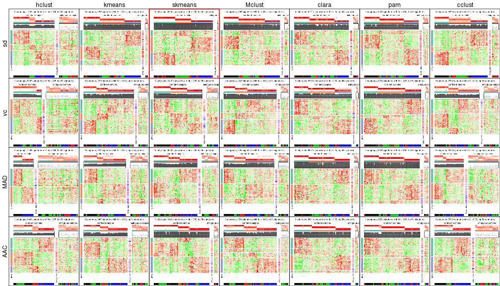
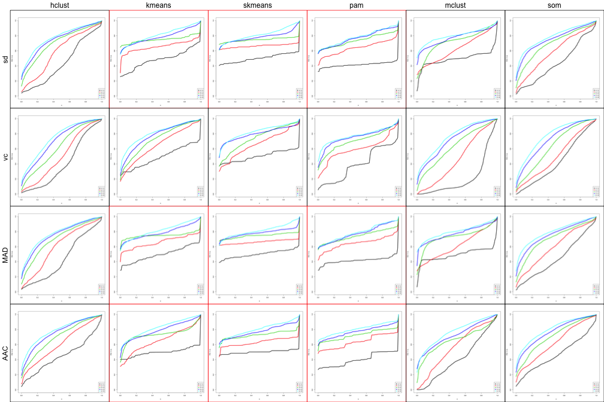
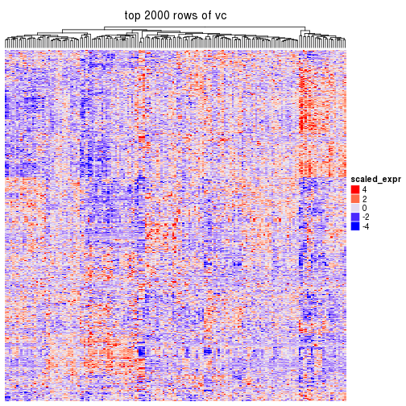
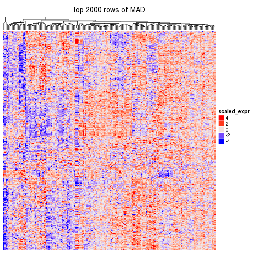
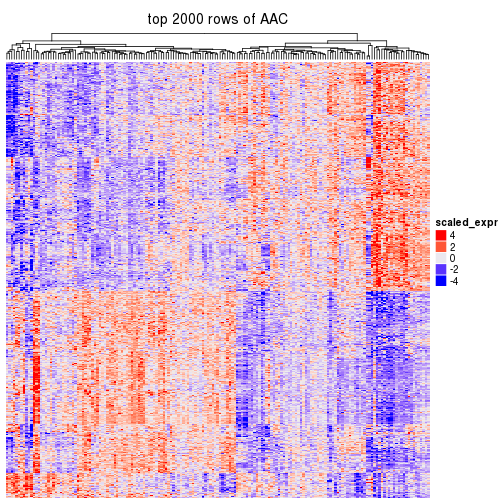
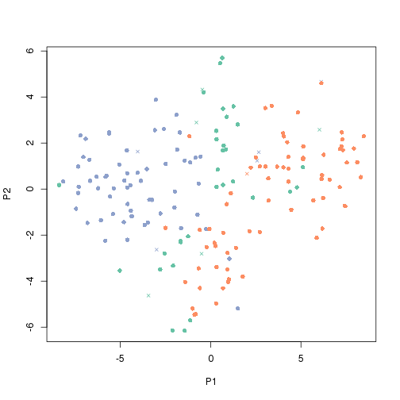
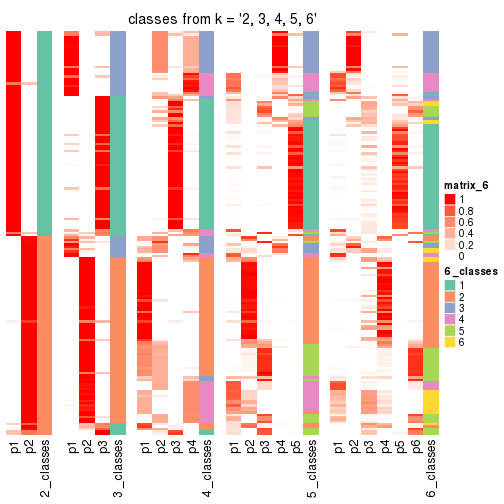

```r
suppressPackageStartupMessages(source("/home/guz/project/development/cola/load.R"))
```

Data is from https://tcga-data.nci.nih.gov/docs/publications/gbm_exp/.


```r
data = read.table("/icgc/dkfzlsdf/analysis/B080/guz/subgroup_test/unifiedScaled.txt", 
	header = TRUE, row.names = 1, check.names = FALSE)
data = as.matrix(data)

subtype = read.table("/icgc/dkfzlsdf/analysis/B080/guz/subgroup_test/TCGA_unified_CORE_ClaNC840.txt", 
	sep = "\t", header = TRUE, check.names = FALSE, stringsAsFactors = FALSE)
subtype = structure(unlist(subtype[1, -(1:2)]), names = colnames(subtype)[-(1:2)])

data = data[, names(subtype)]
dim(data)
```

```
## [1] 11861   173
```

```r
table(subtype)
```

```
## subtype
##   Classical Mesenchymal      Neural   Proneural 
##          38          56          26          53
```

Get all supported top methods and partition methods:


```r
ALL_TOP_VALUE_METHOD()
```

```
## [1] "sd"  "vc"  "MAD" "AAC"
```

```r
ALL_PARTITION_METHOD()
```

```
## [1] "hclust"  "kmeans"  "skmeans" "Mclust"  "clara"   "pam"     "cclust"
```

Run clustering for all combination of methods in batch:


```r
res_list = run_all(data, top_n = c(2000, 4000, 6000), k = 2:6, known = subtype, mc.cores = 4)
```


```r
res_list = readRDS("/icgc/dkfzlsdf/analysis/B080/guz/subgroup_test/TCGA_subgroup_p0.8.rds")
res_list
```

```
## Top rows are extracted by 'sd, vc, MAD, AAC' methods.
## Subgroups are detected by 'hclust, kmeans, skmeans, Mclust, clara, pam, cclust' method.
## Number of partitions are tried for k = 2, 3, 4, 5, 6
```

Collect all plots for a k:


```r
collect_plots(res_list, fun = plot_ecdf)
```


```r
collect_plots(res_list, k = 3, fun = consensus_heatmap)
```


```r
collect_plots(res_list, k = 3, fun = membership_heatmap)
```


```r
collect_plots(res_list, k = 3, fun = get_signatures)
```



Overlap of top rows in different top methods:


```r
par(mfrow = c(1, 3))
top_rows_overlap(res_list, top_n = 2000)
top_rows_overlap(res_list, top_n = 4000)
top_rows_overlap(res_list, top_n = 6000)
```


Also visualize the correspondance of rankings between different scoreing methods:


```r
top_rows_overlap(res_list, top_n = 2000, type = "correspondance")
```



Heatmaps for the top rows:


```r
top_rows_heatmap(res_list, top_n = 2000)
```



Get clustering in a specified combination of top method and partition method:


```r
res = get_single_run(res_list, top_method = "AAC", partition_method = "skmeans")
res
```

```
## top rows are extracted by 'AAC' method.
## Subgroups are detected by 'skmeans' method.
## Number of partitionings are tried for k = 2, 3, 4, 5, 6
```

Collect all plots


```r
collect_plots(res)
```


plots:


```r
select_k(res)
```


```r
consensus_heatmap(res, k = 3)
```


```r
membership_heatmap(res, k = 3)
```


```r
get_signatures(res, k = 3)
```


Get classifications


```r
class_df = get_class(res, k = 3)
head(class_df)
```

```
##                     p1 p2 p3 silhouette class
## TCGA-02-0003-01A-01  0  1  0   0.977354     2
## TCGA-02-0010-01A-01  0  1  0   0.977354     2
## TCGA-02-0011-01B-01  0  1  0   0.977354     2
## TCGA-02-0014-01A-01  0  1  0   0.977354     2
## TCGA-02-0024-01B-01  0  1  0   0.977354     2
## TCGA-02-0026-01B-01  0  1  0   0.977354     2
```

MDS or T-sne plots:


```r
dimension_reduction(res, k = 3)
```


```r
dimension_reduction(res, k = 3, method = "tsne")
```



Consistency of classes.


```r
collect_classes(res_list, k = 3)
```


```r
collect_classes(res)
```



